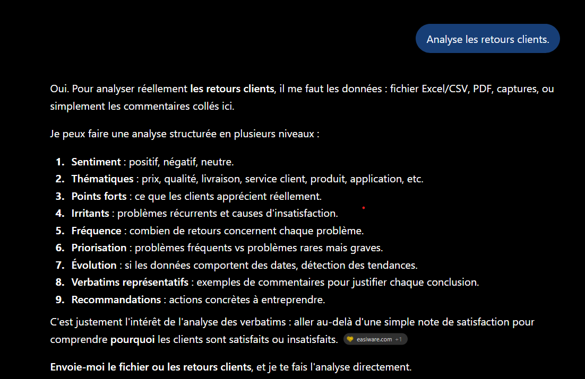
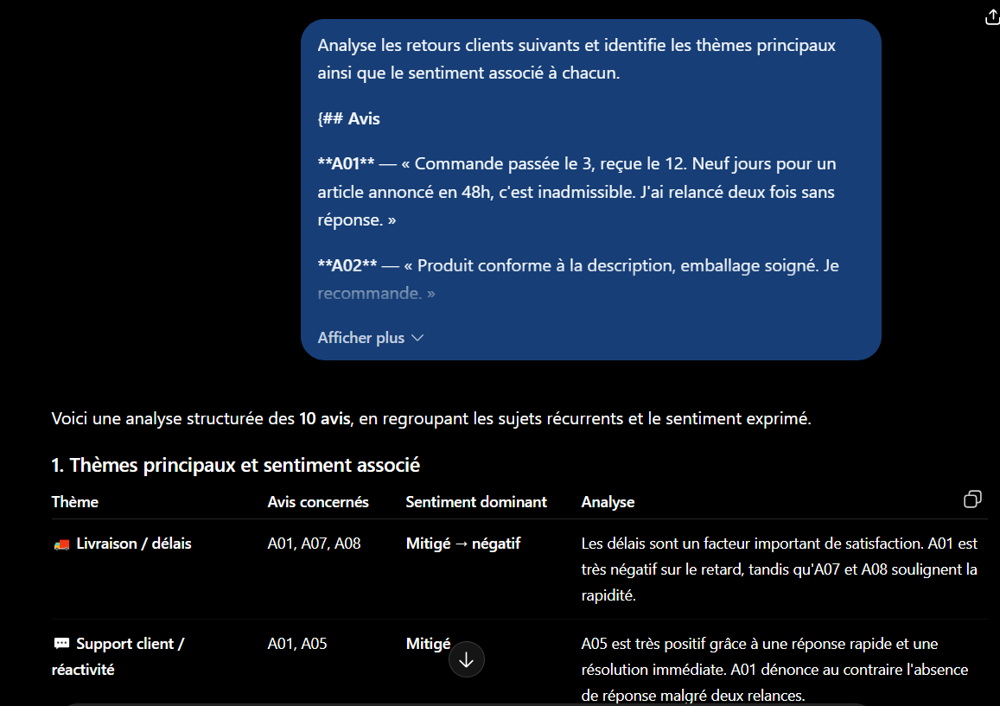
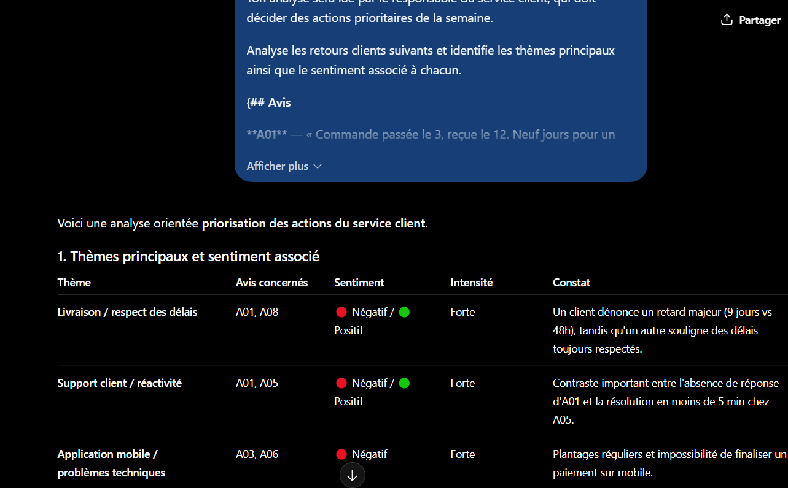
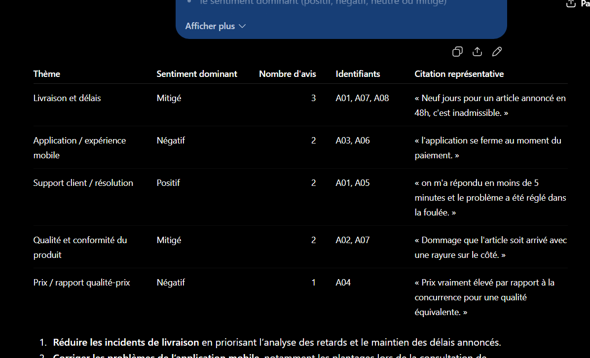
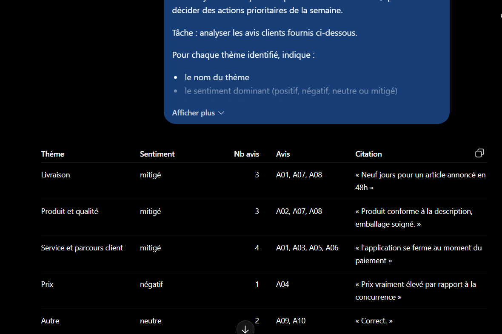

# Partie 1 — Résultats obtenus et analyse

**LLM utilisé :** _(à renseigner : nom du modèle)_
**Date d'exécution :** 12 septembre 2025
**Protocole :** une conversation neuve par version, avis de [`data/avis-clients.md`](../data/avis-clients.md) collés à la place de `{avis}`.

---

## V0 — Intention brute

**Prompt :** voir [`prompts.md`](prompts.md#v0--intention-brute)

**Observations :**

Le modèle **refuse d'analyser** et réclame les données : « Pour analyser réellement les retours clients, il me faut les données ». Il ne produit aucune analyse, mais propose en revanche un **plan méthodologique en 9 axes** (sentiment, thématiques, points forts, irritants, fréquence, priorisation, évolution, verbatims, recommandations), puis conclut par « Envoie-moi le fichier ou les retours clients ».

Fait notable : la réponse contient une **citation de source externe** (`easiware.com`), signe que le modèle a comblé le vide de la consigne en puisant dans ses connaissances générales sur l'analyse de verbatims.

**Ce que cette version révèle :**

Sans **données** ni **tâche** précise, le modèle ne peut que deviner l'intention. Ici il a choisi la stratégie la plus prudente — demander des précisions — mais rien ne garantit ce comportement : selon le modèle ou la formulation, il aurait tout aussi bien pu **inventer des avis fictifs** et les analyser, produisant un résultat plausible et entièrement faux.

Le plan en 9 axes qu'il propose est d'ailleurs instructif : il montre que le modèle *sait* quoi faire, mais qu'il ignore lequel de ces 9 axes on attend de lui. C'est exactement la décision que la composante **Tâche** doit lui retirer.

Cette version sert de **référence de départ** : tout ce que les versions suivantes ajoutent se mesure par rapport à cette réponse vide.

---

## V1 — Ajout de la Tâche

**Prompt :** voir [`prompts.md`](prompts.md#v1--ajout-de-la-tâche)

**Observations :**

_(à compléter)_

**Ce que l'ajout a corrigé :**

_(à compléter)_

---

## V2 — Ajout du Rôle et du Contexte

**Prompt :** voir [`prompts.md`](prompts.md#v2--ajout-du-rôle-et-du-contexte)

**Observations :**

_(à compléter)_

**Ce que l'ajout a corrigé :**

_(à compléter)_

---

## V3 — Ajout des Contraintes et du Format

**Prompt :** voir [`prompts.md`](prompts.md#v3--ajout-des-contraintes-du-format-et-des-délimiteurs)

**Observations :**

_(à compléter)_

**Ce que l'ajout a corrigé :**

_(à compléter)_

---

## V4 — Ajout des Exemples et Critères de qualité

**Prompt :** voir [`prompts.md`](prompts.md#v4--ajout-des-exemples-et-des-critères-de-qualité)

**Observations :**

_(à compléter)_

**Ce que l'ajout a corrigé :**

_(à compléter)_

---

## Test de stabilité

Deux exécutions successives de V1 puis de V4, pour comparer la variabilité.

**Observations :**

_(à compléter)_

---

## Synthèse comparative

Grille remplie à partir des 8 critères définis dans [`prompts.md`](prompts.md#grille-dobservation).

| Critère | V0 | V1 | V2 | V3 | V4 |
|---|---|---|---|---|---|
| Données inventées | | | | | |
| Nombre de thèmes ≤ 5 | | | | | |
| Multi-thèmes (A01, A07) | | | | | |
| Cas ambigus (A03, A07) | | | | | |
| Hors-sujet (A10) → Autre | | | | | |
| Citations exactes | | | | | |
| Format respecté | | | | | |
| Stabilité entre exécutions | | | | | |

**Conclusion :**

_(à compléter)_
