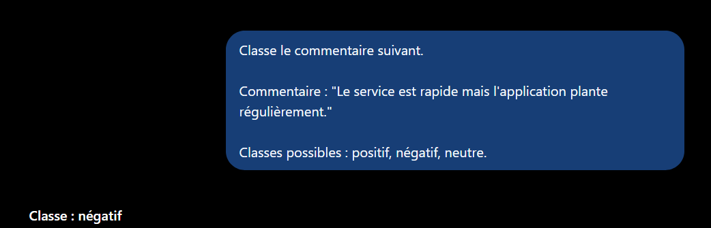
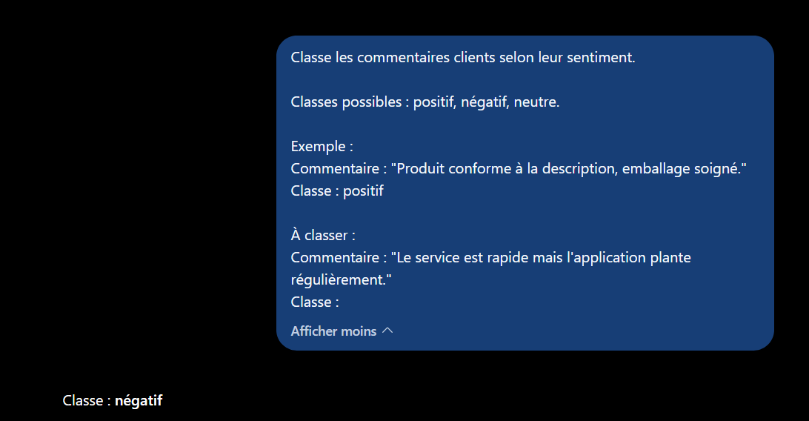
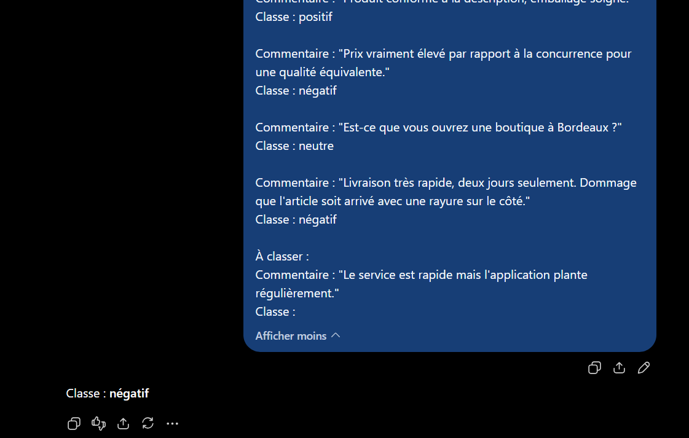
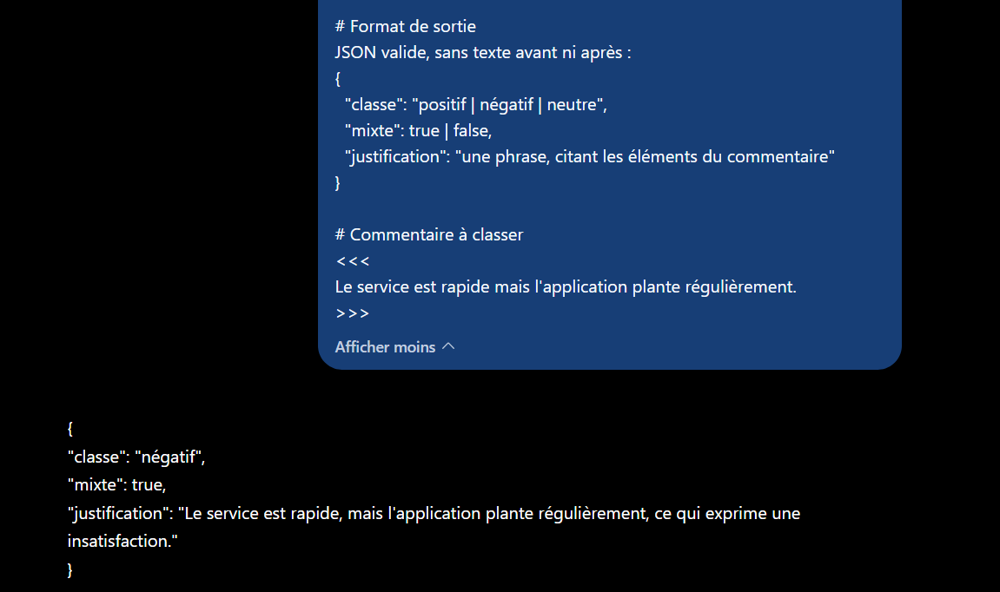

# Partie 2 — Résultats obtenus et analyse

**LLM utilisé :** ChatGPT (OpenAI)
**Date d'exécution :** 12 septembre 2025
**Protocole :** une conversation neuve par technique, même commentaire dans les quatre cas.

**Commentaire testé :** « Le service est rapide mais l'application plante régulièrement. » *(avis A03)*

---

## T1 — Zero-shot

**Prompt :** voir [`prompts.md`](prompts.md#t1--zero-shot)



**Réponse obtenue (intégrale) :**

```text
Classe : négatif
```

**Observations :**

| Critère | Constat |
|---|---|
| Classe choisie | `négatif` |
| Justification | ❌ aucune |
| Format | ✅ `Classe : <valeur>`, choisi spontanément |
| Verbosité | ✅ minimale — 3 mots |
| Ambiguïté signalée | ❌ non |
| Taxonomie respectée | ✅ reste dans les 3 classes |

Le modèle a tranché sans hésiter et sans commentaire. La réponse est **exploitable telle quelle** : un simple parsing sur `Classe : ` suffirait à l'extraire.

**Analyse :**

Le résultat contredit l'hypothèse formulée dans [`prompts.md`](prompts.md#t1--zero-shot) : on s'attendait à un risque de verbosité, à ce que le modèle disserte sur l'ambiguïté du commentaire. Il n'en est rien — il applique implicitement la règle « le défaut l'emporte » et produit une étiquette nue.

**Le choix `négatif` est défendable**, et correspond d'ailleurs à celui qu'on souhaiterait obtenir : le « mais » de la phrase donne le poids à la seconde proposition, et un plantage régulier appelle une action corrective là qu'un service rapide n'en appelle aucune.

**Mais ce choix n'est pas traçable.** Trois informations manquent, et leur absence pose problème dès qu'on passe à l'échelle :

1. **Aucune justification** — impossible de vérifier si le modèle a raisonné ou deviné.
2. **Aucun signalement du caractère mixte** — l'information « ce commentaire contient aussi un point positif » est perdue définitivement. Une entreprise qui agrège 10 000 avis ainsi classés ne saura jamais que son service est jugé rapide.
3. **Aucune garantie de stabilité** — rien dans le prompt ne fixe la règle de décision. Un commentaire mixte au phrasé différent (« l'application plante mais le service est rapide ») pourrait basculer de l'autre côté.

**Ce que cette technique révèle :**

Le zero-shot est **imbattable en coût** : consigne de trois lignes, réponse de trois mots. Pour un cas simple et non ambigu, il suffit.

Sa faiblesse n'apparaît que sur les cas limites, et elle est silencieuse : **la réponse a l'air parfaite**. Rien ne signale qu'une décision arbitraire a été prise sur un cas qui ne rentrait dans aucune case. C'est précisément ce qui rend cette technique risquée en production — l'erreur ne se voit pas.

---

## T2 — One-shot

**Prompt :** voir [`prompts.md`](prompts.md#t2--one-shot)



**Réponse obtenue (intégrale) :**

```text
Classe : négatif
```

**Observations :**

| Critère | Constat | Écart avec T1 |
|---|---|---|
| Classe choisie | `négatif` | **identique** |
| Justification | ❌ aucune | identique |
| Format | ✅ `Classe : <valeur>` | identique |
| Verbosité | ✅ minimale — 3 mots | identique |
| Ambiguïté signalée | ❌ non | identique |
| Taxonomie respectée | ✅ | identique |

**La réponse est rigoureusement identique au zero-shot, sur les six critères.**

**Analyse :**

Ce résultat sans écart est en réalité le plus instructif de la série, à condition de l'interpréter correctement. Il ne signifie pas que le one-shot est inutile en général — il signifie que **cet exemple-là n'apportait rien à ce cas-là**.

L'exemple fourni était :

> « Produit conforme à la description, emballage soigné. » → `positif`

Il enseigne deux choses : le **format** de réponse (`Classe : <valeur>`) et un **cas franchement positif**. Or :

- Le format était déjà correct en zero-shot — le modèle l'avait déduit seul de la structure de la consigne. L'exemple confirme un comportement acquis.
- Le cas positif n'a **aucun rapport** avec la difficulté à résoudre, qui est un cas *mixte*. L'exemple ne dit rien de ce qu'il faut faire quand positif et négatif coexistent.

**Conclusion : un exemple qui ne couvre pas le cas difficile ne coûte que des tokens.**

C'est une leçon transposable : le choix des exemples importe davantage que leur nombre. Un exemple few-shot n'a de valeur que s'il **désambiguïse une décision que la consigne laisse ouverte**. Ici, la consigne laissait ouverte la règle des cas mixtes, et l'exemple parlait d'autre chose.

**Ce que cette comparaison isole :**

Entre T1 et T2, une seule variable a changé — la présence d'un exemple non pertinent. Le résultat inchangé permet d'attribuer proprement à T3 (few-shot avec cas mixte) et T4 (règle explicite) tout écart qui apparaîtrait ensuite.

**Prédiction pour T3 :** le few-shot contient un cas mixte (A07) résolu en `négatif`. Si la classe reste `négatif`, deux interprétations resteront possibles — imitation de l'exemple, ou même raisonnement implicite qu'en T1. Le départage se fera sur T4, où la règle est énoncée et la justification demandée.

---

## T3 — Few-shot

**Prompt :** voir [`prompts.md`](prompts.md#t3--few-shot)



**Réponse obtenue (intégrale) :**

```text
Classe : négatif
```

**Observations :**

| Critère | Constat | Écart avec T1 et T2 |
|---|---|---|
| Classe choisie | `négatif` | **identique** |
| Justification | ❌ aucune | identique |
| Format | ✅ `Classe : <valeur>` | identique |
| Verbosité | ✅ minimale — 3 mots | identique |
| Ambiguïté signalée | ❌ non | identique |
| Taxonomie respectée | ✅ | identique |

**Trois techniques, trois réponses rigoureusement identiques**, alors que le coût en tokens a été multiplié par environ quatre entre T1 et T3.

**Analyse :**

Le quatrième exemple couvrait pourtant bien le cas difficile, contrairement à celui du one-shot :

> « Livraison très rapide, deux jours seulement. Dommage que l'article soit arrivé avec une rayure sur le côté. » → `négatif`

C'est un cas mixte résolu, structurellement analogue au commentaire à classer (un point positif, un point négatif, le négatif l'emportant). L'exemple *enseignait* donc bien la règle « quand c'est mixte, le défaut l'emporte ».

**Et pourtant il n'a rien changé.** Ce qui conduit à la conclusion suivante : le modèle appliquait **déjà** cette règle en zero-shot. L'exemple n'a pas enseigné un comportement, il a confirmé un comportement préexistant.

**Ce que cette convergence établit — et ce qu'elle n'établit pas :**

✅ **Établi :** sur ce cas, les exemples n'apportent aucun gain de classification. La règle implicite du modèle coïncide avec celle qu'on voulait lui transmettre.

❌ **Non établi :** on ne peut **pas** conclure que le few-shot est inutile en général. Deux réserves importantes :

1. **Un seul cas testé.** La convergence sur A03 ne dit rien du comportement sur un commentaire mixte dont on voudrait qu'il soit classé *positif* — là, l'exemple devrait faire une différence, puisqu'il faudrait contredire la règle implicite du modèle.
2. **Une seule exécution par technique.** Sans test de stabilité, on ignore si le few-shot *réduit la variance* entre exécutions. C'est un de ses bénéfices attendus, et il est invisible sur un tirage unique.

**La question restée ouverte :**

Trois techniques donnent `négatif`, mais **aucune ne dit pourquoi**. Impossible de distinguer :

- un modèle qui a identifié le caractère mixte et appliqué délibérément une règle de priorité au défaut ;
- un modèle qui a simplement détecté le mot « plante » et classé sur ce signal.

Les deux produisent la même étiquette sur ce cas, et divergeraient sur d'autres. **C'est exactement ce que T4 va permettre de trancher**, en exigeant une justification et un champ `mixte` explicite.

**Coût comparé :**

| Technique | Longueur du prompt | Résultat |
|---|---|---|
| T1 zero-shot | ~3 lignes | `négatif` |
| T2 one-shot | ~8 lignes | `négatif` |
| T3 few-shot | ~17 lignes | `négatif` |

Sur ce cas précis, **T1 offre le meilleur rapport qualité/coût** : le même résultat pour un cinquième des tokens. Un enseignement contre-intuitif, qui rappelle qu'ajouter des exemples n'est pas une amélioration par défaut — c'est un investissement qui doit se justifier par un gain mesuré.

---

## T4 — Prompt structuré

**Prompt :** voir [`prompts.md`](prompts.md#t4--prompt-structuré)



**Réponse obtenue (intégrale) :**

```json
{
  "classe": "négatif",
  "mixte": true,
  "justification": "Le service est rapide, mais l'application plante régulièrement, ce qui exprime une insatisfaction."
}
```

**Observations :**

| Critère | Constat | Écart avec T1–T3 |
|---|---|---|
| Classe choisie | `négatif` | identique |
| Justification | ✅ fournie, citant les deux éléments | **nouveau** |
| Format | ✅ JSON valide, sans texte parasite | **nouveau** |
| Verbosité | ⚠️ 4 lignes contre 3 mots | plus verbeux |
| Ambiguïté signalée | ✅ `"mixte": true` | **nouveau** |
| Taxonomie respectée | ✅ | identique |

**Analyse :**

**La classe est la même, mais tout le reste a changé.** Les quatre techniques convergent sur `négatif` — ce qui confirme que la classification elle-même n'était pas le problème. Le problème était l'**absence de tout le contexte autour de cette classification**.

Trois gains, chacun répondant à un manque identifié dans les techniques précédentes :

**1. `"mixte": true` — l'information sauvée.**

C'est le gain principal. Les trois premières techniques perdaient définitivement le fait que ce commentaire contient aussi un compliment. Ici, l'information est conservée dans un champ exploitable. Une entreprise agrégeant 10 000 avis peut désormais répondre à la question « combien de nos avis négatifs contiennent malgré tout un point de satisfaction ? » — question impossible avec une étiquette nue.

**2. La justification tranche la question laissée ouverte par T3.**

La justification citée est :

> « Le service est rapide, **mais** l'application plante régulièrement, ce qui exprime une insatisfaction. »

Elle mentionne **les deux éléments** et articule leur relation. Cela écarte l'hypothèse d'une classification par simple détection du mot « plante » : le modèle a bien identifié la structure mixte du commentaire et appliqué la règle de priorité au défaut.

On ne peut pas pour autant affirmer que les techniques T1–T3 procédaient du même raisonnement — on sait seulement qu'**ici**, le raisonnement est correct et vérifiable. C'est précisément la différence : la sortie de T4 est **auditable**, celle de T1 ne l'était pas.

**3. Le JSON est directement consommable.**

Aucun texte avant ni après, structure conforme, champs exactement ceux demandés. `json.loads()` fonctionne sans nettoyage préalable — condition nécessaire pour une intégration applicative.

**Le coût :**

Le prompt structuré est de loin le plus long des quatre (~30 lignes contre 3 pour le zero-shot), et la réponse est plus verbeuse. Ce coût est **assumé et justifié** : il achète la traçabilité, la conservation de l'information et l'exploitabilité machine.

**Ce que cette technique établit :**

Le prompt structuré et le few-shot visent le même objectif — lever l'ambiguïté — par des moyens opposés : **l'exemple montre, la règle énonce**. Sur ce cas, la règle l'emporte nettement, pour une raison structurelle : un exemple ne peut pas transmettre un champ `mixte` ni exiger une justification. Il ne transmet qu'un comportement d'entrée-sortie.

Autrement dit, le few-shot enseigne **quoi répondre** ; le prompt structuré définit **quoi produire et comment le justifier**.

---

## Synthèse comparative des quatre techniques

| Critère | T1 zero-shot | T2 one-shot | T3 few-shot | T4 structuré |
|---|---|---|---|---|
| Classe choisie | négatif | négatif | négatif | négatif |
| Justification fournie | ❌ | ❌ | ❌ | ✅ |
| Format exploitable | ⚠️ texte | ⚠️ texte | ⚠️ texte | ✅ JSON |
| Verbosité de la réponse | 3 mots | 3 mots | 3 mots | 4 lignes |
| Longueur du prompt | ~3 lignes | ~8 lignes | ~17 lignes | ~30 lignes |
| Ambiguïté signalée | ❌ | ❌ | ❌ | ✅ `mixte: true` |
| Taxonomie respectée | ✅ | ✅ | ✅ | ✅ |
| Sortie auditable | ❌ | ❌ | ❌ | ✅ |

### Conclusions

**1. La convergence sur la classe est le résultat central.** Les quatre techniques donnent `négatif`. Sur ce cas, **la difficulté n'était pas de classer** — le modèle savait le faire dès le zero-shot. La difficulté était de rendre la classification vérifiable et de ne pas perdre l'information de nuance.

**2. Les exemples n'ont rien apporté ici, mais pour des raisons différentes.** En T2, l'exemple ne couvrait pas le cas difficile : coût pur. En T3, l'exemple couvrait bien le cas mixte, mais enseignait une règle que le modèle appliquait déjà : redondance. **Un exemple n'a de valeur que s'il corrige un comportement par défaut indésirable.**

**3. Le gain du prompt structuré n'est pas dans la classe, il est dans tout le reste.** `mixte: true`, la justification vérifiable et le JSON parsable sont trois choses qu'aucune quantité d'exemples n'aurait produites. Ce sont des propriétés qui se **spécifient**, pas qui s'**imitent**.

**4. Le choix de technique dépend de l'usage, pas d'une hiérarchie absolue :**

| Situation | Technique recommandée |
|---|---|
| Classification simple, usage ponctuel, cas non ambigus | **Zero-shot** — même résultat, coût minimal |
| Format de sortie inhabituel à faire adopter | **One/few-shot** — l'exemple est plus économique qu'une description |
| Comportement par défaut du modèle à corriger | **Few-shot** — l'exemple contredit la règle implicite |
| Intégration applicative, audit, taxonomie contrainte | **Prompt structuré** — le seul à produire une sortie auditable |

**5. Limites de cette comparaison.** Un seul commentaire, une seule exécution par technique. La stabilité inter-exécutions — bénéfice attendu du few-shot — n'a pas été mesurée, et un cas mixte devant être classé *positif* aurait probablement départagé les techniques autrement. Ces angles morts sont repris en **Partie 8** (évaluation et optimisation des prompts).
