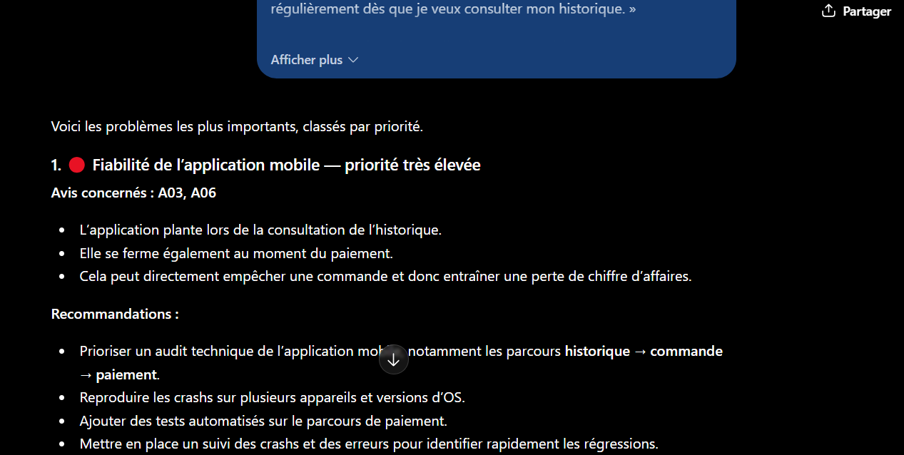
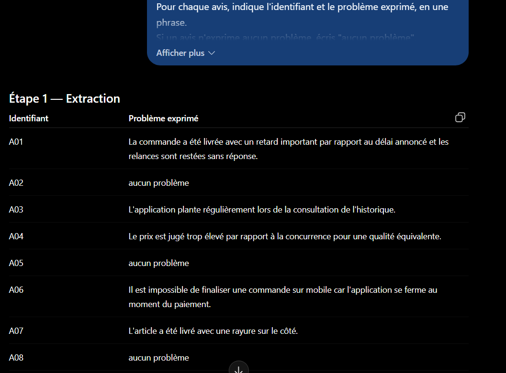

# Partie 3 — Résultats obtenus et analyse

**LLM utilisé :** ChatGPT (OpenAI)
**Date d'exécution :** 12 septembre 2025

---

# Exercice 1 — Décomposition

## P1 — Prompt vague (référence)

**Prompt :** voir [`prompts.md`](prompts.md#p1--prompt-vague-référence)

**Réponse obtenue — synthèse des priorités :**

| Problème | Avis | Priorité attribuée |
|---|---|---|
| Crashs de l'application / paiement | A03, A06 | 🔴 Critique |
| Retard de livraison + support silencieux | A01 | 🔴 Critique |
| Produit endommagé | A07 | 🟠 Élevée |
| Prix trop élevés | A04 | 🟠 Élevée |
| Manque d'information sur les boutiques | A10 | 🟡 Moyenne |

La réponse complète comprend en outre, pour chaque problème, 3 à 5 recommandations détaillées, un encart « Point positif à préserver » (A05, A02, A08) et une « Action prioritaire de la semaine ».

**Observations :**

| Critère | Constat |
|---|---|
| Critère de priorité explicite | ⚠️ partiellement — justifié *a posteriori*, jamais énoncé comme règle |
| Classement obtenu | Application > Livraison > Qualité > Prix > Boutiques |
| Étapes vérifiables séparément | ❌ non — résultat monolithique |
| Recommandations ancrées dans les avis | ❌ non — largement extrapolées |
| Causes inventées | ⚠️ évitées de justesse, mais frôlées |

### L'hypothèse est infirmée sur le classement

On s'attendait à un classement par **fréquence** (Livraison 3 avis en tête). Le modèle a fait mieux : il a classé par **gravité**, plaçant l'application mobile en premier avec seulement 2 avis, et justifie ce choix — « cela peut directement empêcher une commande et donc entraîner une perte de chiffre d'affaires », puis en conclusion « les problèmes les plus susceptibles de bloquer directement l'achat ».

**Le modèle a donc choisi un critère pertinent, et l'a explicité après coup.** C'est un résultat meilleur qu'anticipé, et il nuance le propos du cadrage : sur ce jeu de données, l'implicite n'a pas produit un mauvais classement.

Mais le critère reste **choisi par le modèle, pas par l'utilisateur**. Rien ne garantit qu'un autre lot d'avis, ou une autre exécution, donnerait le même arbitrage. L'utilisateur découvre le critère en lisant la réponse — il ne l'a pas décidé.

### Le vrai problème est ailleurs : les recommandations

C'est là que le prompt vague coûte cher. Sur les ~20 recommandations produites, **la grande majorité ne peut pas être déduite des avis fournis** :

| Recommandation produite | Ancrage dans les avis |
|---|---|
| « Reproduire les crashs sur plusieurs appareils et versions d'OS » | ❌ aucun avis ne mentionne d'appareil ni d'OS |
| « Ajouter des tests automatisés sur le parcours de paiement » | ❌ aucune information sur les pratiques de test |
| « Vérifier les conditions de stockage et de transport » | ❌ aucun avis ne parle de stockage |
| « Suivre le taux de produits endommagés par transporteur » | ❌ aucun transporteur mentionné |
| « Tester des promotions, bundles ou programmes de fidélité » | ❌ aucun avis n'évoque de dispositif commercial |
| « Réaliser une veille régulière des prix concurrents » | ⚠️ A04 mentionne « la concurrence », sans plus |
| « Définir un SLA de réponse du support » | ⚠️ déduit de « relancé deux fois sans réponse » |

**Ces recommandations ne sont pas fausses — elles sont de bon sens.** C'est précisément ce qui les rend problématiques : elles proviennent des connaissances générales du modèle en e-commerce, pas de l'analyse des avis. Un lecteur ne peut pas distinguer ce qui vient des données de ce qui vient du modèle.

Le prompt demandait « les recommandations » sans préciser leur fondement. Le modèle a comblé ce vide par son savoir général — comportement raisonnable, mais qui transforme une analyse de données en consultation générique.

### Deux erreurs factuelles

**1. A01 rattaché à un seul thème.** Le modèle fusionne « Retards de livraison **et** absence de réponse du support » en un seul problème. Or ce sont deux problèmes distincts appelant deux actions différentes (logistique / service client). A05 montre d'ailleurs que le support fonctionne bien par ailleurs — l'information est reléguée dans l'encart « point positif » au lieu de nuancer le diagnostic.

**2. A10 traité comme un problème.** « Est-ce que vous ouvrez une boutique à Bordeaux ? » est une **question**, pas une insatisfaction. Le modèle en tire un problème d'« informations insuffisantes sur l'implantation physique » et recommande de créer une page boutiques et une FAQ. C'est une sur-interprétation : un seul client a posé une question, rien n'indique un manque d'information généralisé.

À l'inverse, **A09 (« Correct. ») est correctement ignoré** — le modèle n'a pas cherché à en tirer un problème.

### Ce que P1 établit

Le prompt vague produit une réponse **impressionnante et largement juste sur le diagnostic**, mais :

- le critère de priorité est un choix du modèle, non de l'utilisateur ;
- les recommandations mélangent, sans distinction visible, ce qui vient des avis et ce qui vient du savoir général du modèle ;
- une question est requalifiée en problème ;
- aucune étape n'est vérifiable isolément : pour contrôler le classement, il faut relire toute la réponse.

**C'est exactement ce que la décomposition (P2) doit corriger** — non pas en rendant le modèle plus intelligent, mais en rendant chaque étape auditable et en ancrant explicitement les recommandations dans les données.

---

## P2 — Prompt décomposé

**Prompt :** voir [`prompts.md`](prompts.md#p2--prompt-décomposé)

**Réponse obtenue (extraits) :**

**Étape 1 — Extraction** : un problème par avis, avec « aucun problème » pour A02, A05, A08, A09 **et A10**.

**Étape 2 — Regroupement** : 4 thèmes (livraison+relances, application, prix, produit endommagé).

**Étape 3 — Mesure** :

| Thème | Fréquence | Gravité |
|---|---:|---|
| Délais de livraison et absence de réponse aux relances | 1 | Élevée |
| Problèmes de fonctionnement de l'application | 2 | Élevée |
| Prix jugé trop élevé | 1 | Moyenne |
| Produit endommagé à la livraison | 1 | Moyenne |

**Étape 4 — Priorisation** : Application (1) > Livraison (2) > Prix (3) > Produit endommagé (4).

**Étape 5 — Recommandations** : trois actions, dont deux portant la mention « cause non précisée dans les avis ».

**Observations :**

| Critère | P1 vague | P2 décomposé |
|---|---|---|
| Critère de priorité explicite | ⚠️ justifié a posteriori | ✅ règle appliquée et citée |
| Classement obtenu | Application > Livraison > Qualité > Prix > Boutiques | Application > Livraison > Prix > Produit |
| Étapes vérifiables séparément | ❌ monolithique | ✅ 5 étapes distinctes |
| Recommandations ancrées | ❌ ~20, largement extrapolées | ✅ 3, toutes ancrées |
| Causes inventées | ⚠️ frôlées | ✅ aucune, mention explicite |
| A10 traité comme problème | ❌ oui | ✅ non — « aucun problème » |

### Le gain principal : les recommandations redeviennent des recommandations

C'est l'écart le plus net entre les deux versions.

| | P1 | P2 |
|---|---|---|
| Nombre de recommandations | ~20 | 3 |
| Ancrées dans les avis | minoritaires | toutes |
| Exemples produits | « tests automatisés », « versions d'OS », « conditions de stockage », « programmes de fidélité » | « corriger les plantages signalés lors de la consultation de l'historique et au moment du paiement » |

P2 ne recommande plus rien qui ne réponde à un problème effectivement présent dans les avis. Les extrapolations ont disparu — non parce que le modèle en sait moins, mais parce que la contrainte « ne propose aucune recommandation qui ne corresponde pas à un thème identifié à l'étape 2 » lui interdit de mobiliser son savoir général.

**Contrepartie assumée :** P2 est beaucoup moins riche. Les recommandations de P1 étaient utiles — un responsable technique voudra bien tester sur plusieurs OS. Mais elles étaient présentées comme issues de l'analyse alors qu'elles n'en venaient pas. **P2 sépare ce que les données disent de ce que le modèle sait.** C'est cette séparation qui a de la valeur, pas l'appauvrissement en soi.

### La mention « cause non précisée dans les avis » fonctionne

Deux recommandations sur trois la portent. C'est la contrainte anti-hallucination la plus efficace observée depuis le début de l'atelier : au lieu d'interdire au modèle d'inventer une cause — interdiction difficile à vérifier — elle lui donne **une formule à produire** à la place. L'absence d'information devient un élément positif de la réponse, donc contrôlable.

À comparer avec P1, où le modèle écrivait « Identifier la cause du retard : préparation, transporteur ou traitement interne » — trois causes plausibles, aucune présente dans les avis.

### La règle de priorité est appliquée, et sa trace est visible

L'étape 3 contient une phrase révélatrice :

> « Selon la règle fournie, le thème "problèmes de fonctionnement de l'application" est donc de gravité élevée **à cause de A06**. »

Le modèle explicite son raisonnement : A03 seul ne bloque pas l'achat, A06 si, donc le thème hérite de la gravité la plus élevée. Ce raisonnement était **invisible en P1**, où la conclusion identique arrivait sans démonstration.

C'est la définition même d'une étape auditable : on peut contester ce choix d'héritage — fallait-il séparer A03 et A06 en deux thèmes ? — parce qu'il est exposé.

### Deux limites relevées

**1. A01 reste un thème double.** Comme en P1, « Délais de livraison **et** absence de réponse aux relances » fusionne deux problèmes appelant deux actions distinctes (logistique / support). La décomposition n'a pas corrigé ce point : l'étape 2 demandait de regrouper, sans interdire de regrouper deux problèmes hétérogènes issus du même avis.

**2. Le classement 3/4 est arbitraire, mais le modèle le dit.** Prix et Produit endommagé ont même gravité et même fréquence. Le modèle écrit : « aucun élément des avis ne permet de les départager davantage ». Il signale l'indécidabilité au lieu de trancher en silence — comportement correct, qui révèle une **incomplétude de la règle de priorité** fournie dans le prompt. Une règle de rang 3 manquait.

### Ce que la décomposition a réellement apporté

Le **diagnostic est quasi identique** entre P1 et P2 : mêmes thèmes, même tête de classement. La décomposition n'a pas rendu le modèle plus perspicace.

Ce qu'elle a changé :

1. **Traçabilité** — chaque étape est contrôlable isolément. Une erreur à l'étape 1 se voit sans relire l'étape 5.
2. **Ancrage** — la frontière entre les données et le savoir du modèle devient visible.
3. **Signalement de l'incertitude** — « cause non précisée », « aucun élément ne permet de départager ».
4. **Contestabilité** — les choix étant exposés, ils peuvent être discutés et le prompt corrigé.

**La décomposition n'améliore pas la réponse, elle la rend vérifiable.** C'est un objectif différent, et c'est précisément ce dont on a besoin dès qu'une analyse sert à décider.
