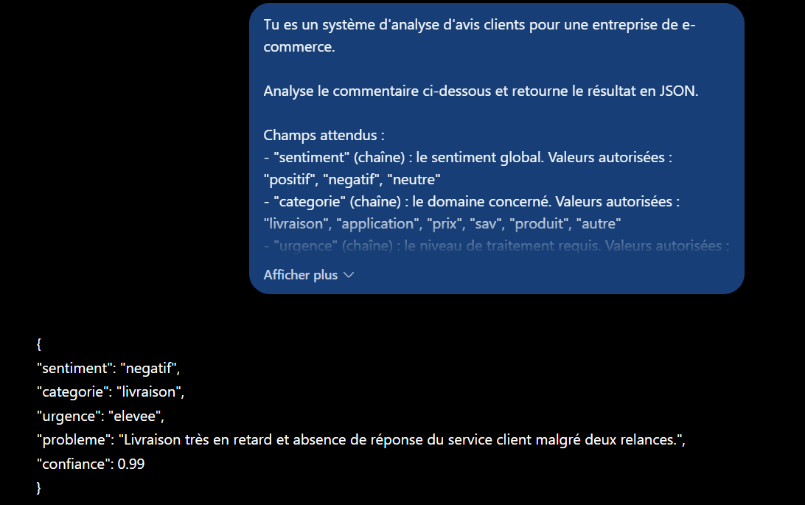
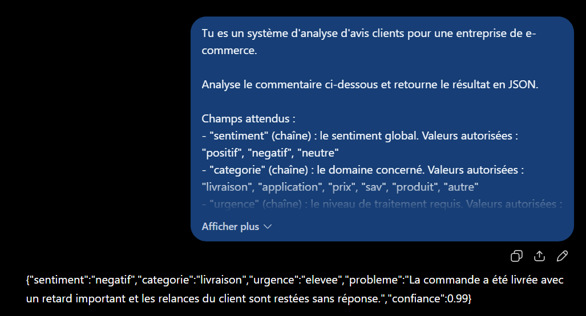
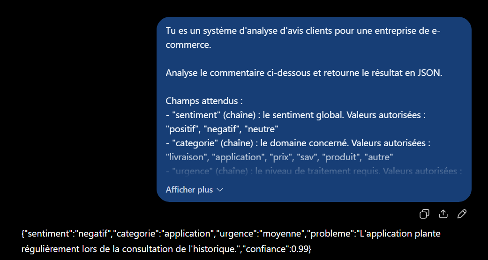

# Partie 4 — Résultats obtenus et analyse

**LLM utilisé :** ChatGPT (OpenAI)
**Date d'exécution :** 12 septembre 2025

---

## Q1 — Demander le JSON, sans règles de validation

**Prompt :** voir [`prompts.md`](prompts.md#q1--demander-le-json)



**Réponse obtenue (intégrale) :**

```json
{
  "sentiment": "negatif",
  "categorie": "livraison",
  "urgence": "elevee",
  "probleme": "Livraison très en retard et absence de réponse du service client malgré deux relances.",
  "confiance": 0.99
}
```

**Observations :**

| Critère | Constat |
|---|---|
| JSON valide | ✅ parsable tel quel |
| Texte parasite | ✅ aucun — pas de « Voici le résultat », pas de bloc markdown |
| Exactement 5 champs | ✅ ni plus ni moins |
| Énumérations respectées | ✅ `negatif`, `livraison`, `elevee` sont bien dans les domaines |
| `confiance` de type nombre | ✅ `0.99` sans guillemets |
| Valeur de `confiance` | ⚠️ 0.99 — discutable, voir ci-dessous |

**La sortie est directement consommable.** `json.loads()` fonctionne sans nettoyage, les cinq champs sont présents, les trois énumérations tenues et `confiance` est bien un nombre.

### Le contraste avec la prose de l'énoncé

| | Réponse en prose | JSON obtenu |
|---|---|---|
| Sentiment | « semble **plutôt** négatif » | `"negatif"` |
| Extraction | analyse de texte requise | `data["sentiment"]` |
| Agrégation | impossible | `GROUP BY sentiment` |
| Urgence | absente | `"elevee"` |
| Incertitude | modalisée dans la phrase | `0.99`, champ dédié |

Le gain n'est pas seulement une question de forme : **le JSON force à nommer des choses que la prose laissait implicites**. L'urgence n'existait pas dans la réponse d'origine — le champ l'a fait apparaître.

### Le point discutable : `confiance: 0.99`

L'avis A01 contient **deux problèmes distincts** :

- un retard de livraison (9 jours au lieu de 48h) → catégorie `livraison`
- deux relances sans réponse → catégorie `sav`

Le modèle a choisi `livraison` et mentionné le SAV dans le champ `probleme` — arbitrage défendable, le retard étant le grief principal. **Mais il annonce une confiance de 0,99 sur ce choix**, soit une quasi-certitude, alors que `sav` aurait été tout aussi justifiable.

C'est une observation importante : **`confiance` mesure ici la certitude sur l'analyse du sentiment, pas sur le choix de la catégorie.** Le prompt disait « ton niveau de certitude sur cette analyse » — formulation trop vague pour désigner *quoi*, dans une sortie à cinq champs.

Le sentiment est effectivement indiscutable (« c'est inadmissible »), ce qui justifie 0,99. L'arbitrage de catégorie, lui, ne l'est pas. **Un seul scalaire ne peut pas porter la confiance de cinq champs hétérogènes.**

Deux corrections possibles, à retenir pour un usage réel :

1. préciser ce que `confiance` qualifie (« ta certitude sur le champ `sentiment` ») ;
2. ou prévoir un champ `categorie_secondaire`, voire une confiance par champ.

### Les hypothèses sont infirmées

Aucun des trois risques anticipés ne s'est matérialisé : pas de bloc markdown, pas de texte d'introduction, pas de `confiance` en chaîne. Le modèle a produit exactement ce qui était décrit.

**Cela crée la bonne condition pour la question 2 :** si Q1 est déjà conforme, que peuvent bien ajouter les règles de validation ? C'est précisément ce que le prompt Q2 doit permettre de mesurer — et le résultat risque d'être « rien de visible », ce qui sera en soi un enseignement sur la différence entre *demander* et *garantir*.

---

## Q2 — Ajouter les règles de validation

**Prompt :** voir [`prompts.md`](prompts.md#q2--ajouter-les-règles-de-validation)



**Réponse obtenue (intégrale) :**

```json
{"sentiment":"negatif","categorie":"livraison","urgence":"elevee","probleme":"La commande a été livrée avec un retard important et les relances du client sont restées sans réponse.","confiance":0.99}
```

**Observations :**

| Critère | Q1 | Q2 | Écart |
|---|---|---|---|
| `sentiment` | `negatif` | `negatif` | identique |
| `categorie` | `livraison` | `livraison` | identique |
| `urgence` | `elevee` | `elevee` | identique |
| `confiance` | `0.99` | `0.99` | identique |
| `probleme` | formulation A | formulation B | reformulé |
| **Mise en forme** | indenté, multi-lignes | **minifié, une ligne** | ✅ changement |
| Règle 1 (rien d'autre) | ✅ | ✅ | — |
| Règle 2 (5 champs) | ✅ | ✅ | — |
| Règles 3, 4, 5 (domaines) | ✅ | ✅ | — |

**Les cinq règles sont respectées, et les valeurs sont rigoureusement identiques à Q1.**

### Le seul effet visible : la minification

C'est le changement le plus intéressant, et il n'était pas demandé. Aucune règle ne parlait d'indentation — la règle 1 disait « un JSON valide, et rien d'autre ».

Le modèle a interprété « et rien d'autre » comme incluant **les espaces de présentation**. Il a produit la forme la plus dépouillée possible : un JSON sur une seule ligne, sans espace superflu.

C'est un cas net de **sur-interprétation d'une contrainte**, analogue à celui observé en Partie 1 (V4, où l'exemple few-shot transmettait une granularité non voulue). La contrainte visait le texte parasite ; le modèle l'a étendue à la lisibilité.

**Est-ce un problème ?** Fonctionnellement non — les deux formes se parsent identiquement. Mais cela illustre un principe : **une contrainte formulée en négatif (« rien d'autre ») a une portée floue**. Le modèle décide lui-même où s'arrête l'interdiction. Une formulation positive serait plus prévisible : *« Réponds uniquement par l'objet JSON, indenté sur deux espaces. »*

### Le champ `probleme` a été reformulé

| Q1 | Q2 |
|---|---|
| « Livraison très en retard et absence de réponse du service client malgré deux relances. » | « La commande a été livrée avec un retard important et les relances du client sont restées sans réponse. » |

Les deux sont exactes et équivalentes en contenu. **C'est le seul champ libre du schéma, et c'est le seul qui varie** — les quatre champs énumérés ou numériques sont stables au caractère près.

Cette observation vaut démonstration du principe posé dans le [cadrage](README.md#2-ce-que-préciser-les-types-et-les-valeurs-autorisées-implique) : **ce qui est contraint est reproductible, ce qui est libre ne l'est pas.** Un champ texte libre ne doit donc jamais servir de clé de regroupement ou de filtre — seulement de contexte pour un lecteur humain.

### Ce que Q2 démontre — et ne démontre pas

**L'hypothèse est confirmée : sur un cas facile, les règles ne changent rien de visible.** Q1 était déjà conforme ; Q2 le reste. On ne peut donc **pas** conclure de cette comparaison que les règles sont efficaces — seulement qu'elles ne dégradent rien.

C'est la limite d'un test sur un cas non ambigu. L'avis A01 est franchement négatif, franchement urgent, et sa catégorie principale est évidente. Rien dans ce commentaire ne pousse le modèle vers une nuance interdite.

**La vraie question reste ouverte :** que se passe-t-il quand le commentaire *résiste* aux énumérations ? C'est l'objet de Q3, avec un avis mixte que la valeur `negatif` ne décrit qu'imparfaitement.

### Une distinction à ne pas perdre de vue

Ce test rappelle la différence posée dans le cadrage entre **demander** et **garantir** :

- Les règles dans le prompt ont produit une sortie conforme — mais elles l'avaient déjà produite sans les règles.
- Rien ici ne prouve qu'elles **empêcheraient** une sortie non conforme sur un autre commentaire, ou lors d'une autre exécution.

**Une règle énoncée dans un prompt reste une instruction, pas une contrainte technique.** La garantie ne peut venir que d'une validation côté application — d'où le [`schema.json`](schema.json) produit dans cette partie, qui traduit les cinq règles en contrat vérifiable par du code.

---

## Q3 — Test sur cas ambigu

**Prompt :** identique à Q2, seul le commentaire change — voir [`prompts.md`](prompts.md#q3--test-sur-cas-ambigu)

**Commentaire testé :** « Le service est rapide mais l'application plante régulièrement dès que je veux consulter mon historique. » *(avis A03)*



**Réponse obtenue (intégrale) :**

```json
{"sentiment":"negatif","categorie":"application","urgence":"moyenne","probleme":"L'application plante régulièrement lors de la consultation de l'historique.","confiance":0.99}
```

**Observations :**

| Critère | Constat |
|---|---|
| JSON valide | ✅ |
| Règles 1 à 5 | ✅ toutes respectées |
| `sentiment` | `negatif` — cohérent avec la Partie 2 |
| `categorie` | `application` — correct |
| `urgence` | `moyenne` — correctement abaissée par rapport à A01 |
| **`confiance`** | ❌ **0.99 — l'ambiguïté n'est pas signalée** |

### Le résultat : issue n° 2, l'ambiguïté est perdue silencieusement

Des trois issues anticipées, c'est la deuxième qui s'est produite. La règle 3 a tenu — aucune nuance inventée — mais **le champ `confiance` n'a pas joué son rôle**.

L'avis A03 contient explicitement un élément positif (« le service est rapide ») et un élément négatif (« l'application plante régulièrement »). La Partie 2 avait établi que le modèle *identifie* bien cette structure mixte : interrogé avec un champ `mixte` dédié, il répondait `true` et citait les deux éléments.

**Ici, la même ambiguïté est écrasée en une certitude de 99 %.**

### Le constat le plus fort : `confiance` est constante

| Commentaire | Nature | `confiance` |
|---|---|---|
| A01 (Q1) — « c'est inadmissible », deux catégories possibles | négatif franc, catégorie discutable | **0.99** |
| A01 (Q2) — idem, avec règles de validation | idem | **0.99** |
| A03 (Q3) — mixte, positif + négatif | **ambigu par construction** | **0.99** |

**Trois exécutions, trois fois exactement 0.99**, sur des commentaires de difficulté très différente. Le champ ne varie pas — il est **décoratif**.

Un champ de confiance qui ne descend jamais n'apporte aucune information : il ne permet ni de trier les cas à revoir manuellement, ni de fixer un seuil de traitement automatique. Pire, **il donne une fausse assurance** : une application qui filtrerait sur `confiance > 0.9` laisserait passer tous les cas ambigus.

### Pourquoi le champ échoue

Deux causes se cumulent :

**1. La consigne ne dit pas sur quoi porte la confiance.** « Ton niveau de certitude sur cette analyse » — quelle analyse ? Le sentiment ? La catégorie ? L'ensemble ? Face à cinq champs hétérogènes dont certains sont sûrs et d'autres non, un scalaire unique n'a pas de référent clair. Le modèle a répondu sur ce qui était le plus sûr.

**2. Aucune règle ne relie `confiance` à l'ambiguïté.** Les cinq règles de l'énoncé contraignent le *domaine* de `confiance` (entre 0 et 1) mais jamais sa *sémantique*. Rien n'indique quand elle doit baisser. Or la Partie 3 l'a montré avec « cause non précisée dans les avis » : **le modèle signale l'incertitude quand on lui donne une formule à produire, pas quand on lui laisse le soin d'y penser.**

### Correction proposée

Ajouter une règle explicitant le comportement attendu :

```text
6. "confiance" reflète ta certitude sur le champ "sentiment" uniquement.
   Si le commentaire contient à la fois un élément positif et un élément
   négatif, "confiance" ne doit pas dépasser 0.7.
```

Cette règle est **vérifiable** : on peut confronter la valeur de `confiance` à la présence d'un « mais » ou de deux polarités dans le texte. Elle transforme un champ décoratif en signal exploitable.

La correction alternative, plus robuste, consiste à **ne pas faire porter l'ambiguïté par un scalaire** mais par un champ dédié — le `"mixte": true` de la Partie 2, qui avait parfaitement fonctionné. Un booléen explicite bat un nombre dont la sémantique est implicite.

---

# Synthèse de la Partie 4

## Grille comparative

| Critère | Q1 (sans règles) | Q2 (avec règles) | Q3 (cas ambigu) |
|---|---|---|---|
| JSON valide | ✅ | ✅ | ✅ |
| Texte parasite | ✅ aucun | ✅ aucun | ✅ aucun |
| Exactement 5 champs | ✅ | ✅ | ✅ |
| Énumérations respectées | ✅ | ✅ | ✅ |
| `confiance` de type nombre | ✅ | ✅ | ✅ |
| Mise en forme | indentée | minifiée | minifiée |
| Ambiguïté signalée | n/a | n/a | ❌ |

## Enseignements

**1. Le JSON force à nommer l'implicite.** La prose de l'énoncé ne mentionnait aucune urgence ; le champ l'a fait apparaître. Structurer une sortie, ce n'est pas seulement la mettre en forme — c'est décider *quelles dimensions* comptent.

**2. Ce qui est contraint est reproductible, ce qui est libre ne l'est pas.** Entre Q1 et Q2, les quatre champs énumérés ou numériques sont identiques au caractère près ; le seul champ libre, `probleme`, a été reformulé. **Un champ texte libre ne doit jamais servir de clé de filtrage ou de regroupement.**

**3. Sur un cas facile, les règles de validation sont invisibles.** Q1 était déjà conforme. On ne peut donc pas conclure que les règles sont efficaces — seulement qu'elles ne dégradent rien. Leur valeur ne se mesure que face à un cas qui les met à l'épreuve.

**4. Une contrainte formulée en négatif a une portée floue.** « Un JSON valide, et rien d'autre » a été étendu par le modèle jusqu'à supprimer l'indentation. Une formulation positive (« réponds par l'objet JSON indenté sur deux espaces ») est plus prévisible.

**5. Contraindre le domaine d'un champ ne garantit pas qu'il porte du sens.** C'est l'enseignement principal. `confiance` respecte parfaitement sa règle — un nombre entre 0 et 1 — tout en étant **inutile** : constante à 0.99 sur trois cas de difficulté très différente. Une règle de *type* n'est pas une règle de *sémantique*.

**6. L'ambiguïté doit être portée par un champ dédié, pas déduite.** La Partie 2 avait obtenu `"mixte": true` sur ce même avis A03, avec une justification citant les deux éléments. Ici, avec un scalaire à la sémantique implicite, la même information est perdue. **Un booléen explicite bat un nombre qu'on espère interprété correctement.**

**7. La validation réelle est côté application.** Les cinq règles ont été respectées sur trois exécutions, mais rien ne le garantit à la quatrième. Voir [`schema.json`](schema.json), qui traduit ces règles en contrat exécutable.
