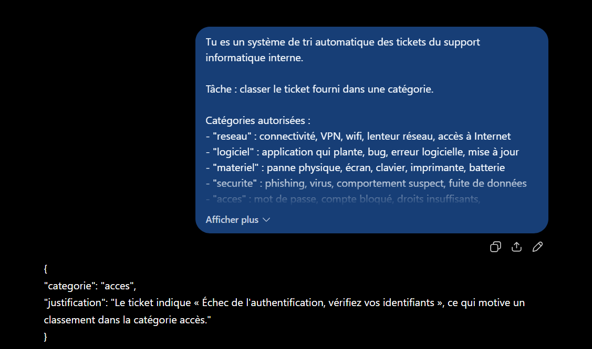
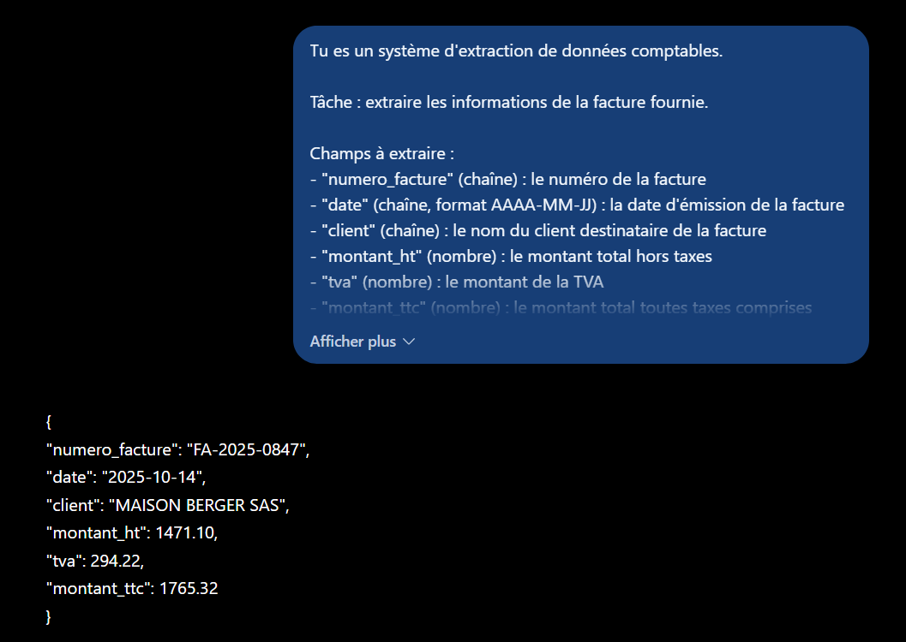
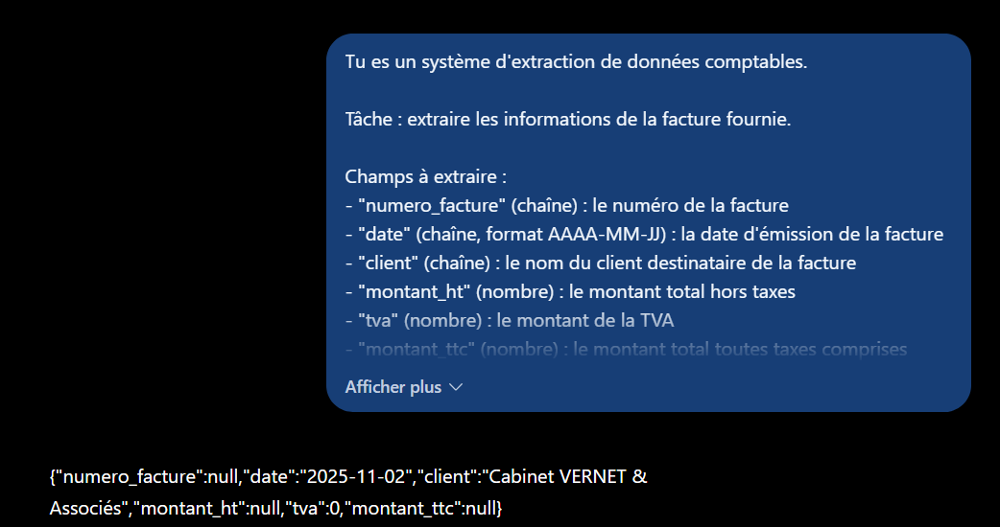

# Partie 5 — Résultats obtenus et analyse

**LLM utilisé :** ChatGPT (OpenAI)
**Date d'exécution :** 12 septembre 2025

---

## 5.1 — Résumé de document

**Prompt :** voir [`prompts.md`](prompts.md#51--résumé-de-document)
**Source :** [`rapport-trimestriel.md`](../data/rapport-trimestriel.md) — environ 950 mots


**Réponse obtenue (intégrale) :**

> ### Objectifs
> - Réduire le délai moyen de première réponse de 14 h à moins de 6 h.
> - Porter la résolution au premier contact de 61 % à 75 %.
> - Déployer le chat en direct sur tout le site avant le 15 septembre 2025.
>
> ### Résultats
> - Délai moyen : **7 h 20**, contre 14 h 10 au trimestre précédent. **Objectif non atteint**. Septembre atteint toutefois **4 h 15**.
> - Résolution au premier contact : **68 %**, contre 61 %. **Objectif de 75 % non atteint**. Les problèmes techniques applicatifs affichent **34 %** de résolution et représentent **22 %** des contacts.
> - Chat déployé le **9 septembre**, six jours avant l'échéance : **objectif atteint**. Il a traité **2 847 conversations**, soit **18 %** des contacts, avec une satisfaction de **4,3/5**.
> - Volume total : **15 820 contacts**, en hausse de **8 %** par rapport au deuxième trimestre.
> - Les deux recrutements prévus ont été réalisés les **12 août** et **3 septembre**.
>
> ### Recommandations
> - Maintenir la cible de **6 heures**, sans renforcement d'effectif supplémentaire.
> - Créer une cellule technique de premier niveau pour résoudre directement **50 %** des problèmes techniques actuellement escaladés, avec un coût estimé à **85 000 € annuels** pour deux postes, sous réserve de validation financière.
> - Négocier avec l'équipe technique un délai d'escalade ramené de **4 à 2 jours ouvrés**.
> - Étendre le chat aux heures de soirée, **18 h–21 h**, période représentant **23 %** des visites du site.

**Observations :**

| Critère | Constat |
|---|---|
| Longueur | ✅ **234 mots** sur 250 autorisés |
| Structure imposée | ✅ les trois intertitres, dans l'ordre |
| Objectifs non atteints signalés | ✅ **explicitement, deux fois** |
| Chiffres conservés | ✅ 17 valeurs numériques reprises, toutes exactes |
| Invention | ✅ aucune |
| Taux de compression | 950 → 234 mots, soit ~75 % |

### Le piège principal est évité

C'était le point de vigilance central. Le document dit que **septembre** atteint l'objectif (4 h 15) alors que **le trimestre** ne l'atteint pas (7 h 20). Un résumé qui retiendrait « objectif atteint » serait faux.

La formulation produite est exactement celle qu'il fallait :

> « Délai moyen : **7 h 20** [...] **Objectif non atteint**. Septembre atteint **toutefois** 4 h 15. »

L'ordre est correct — le constat trimestriel d'abord, la nuance mensuelle ensuite — et le « toutefois » marque la subordination. L'information favorable est conservée sans qu'elle écrase le constat d'échec.

**La contrainte « si un objectif n'est pas atteint, dis-le explicitement ; ne présente pas un résultat partiel comme un succès » a donc fonctionné**, et elle était nécessaire : sans elle, la tentation de mettre en avant la progression (14 h 10 → 7 h 20, soit une division par deux) était forte.

### Les arbitrages de compression

Avec 234 mots pour 950, le modèle a dû sacrifier environ trois quarts du contenu. Ce qu'il a conservé et écarté est révélateur :

| Conservé | Écarté |
|---|---|
| Les 3 objectifs, les 4 recommandations | Le budget de 340 000 € et sa ventilation |
| Tous les résultats chiffrés principaux | Le détail par motif (89 %, 72 %, 81 %) |
| Le coût de 85 000 € de la reco 2 | Toute la section « Difficultés rencontrées » |
| Les dates de recrutement | Le décalage de recrutement et sa cause |
| La satisfaction chat 4,3/5 | La comparaison 3,8 (tel) et 3,6 (email) |

**Les arbitrages sont cohérents avec la consigne.** Le prompt demandait trois choses — objectifs, résultats, recommandations — et le modèle a coupé ce qui n'entrait dans aucune : les moyens, les difficultés, le contexte.

Une observation intéressante : il a gardé le **34 %** de résolution des problèmes techniques et le **22 %** de contacts concernés, en écartant les trois autres lignes du tableau. C'est le bon choix — ce sont les deux chiffres qui justifient la recommandation n° 2, donc les seuls qui portent une décision.

### Une omission discutable

La section 4 « Difficultés rencontrées » a entièrement disparu, y compris le décalage de recrutement qui explique la contre-performance de juillet. Pour un comité de direction — destinataire annoncé dans le prompt — cette information est utile : elle distingue un échec structurel d'un échec conjoncturel.

**Ce n'est pas une faute du modèle**, c'est une lacune du prompt : les trois intertitres imposés ne prévoyaient pas de rubrique pour les difficultés. Le modèle a respecté la structure demandée.

Correction possible : ajouter un quatrième intertitre « Difficultés », ou élargir la consigne « Résultats » à « Résultats et facteurs explicatifs ».

### Ce que cette tâche établit

**1. Le conflit longueur / exhaustivité se règle par la hiérarchisation, pas par la troncature.** Le modèle n'a pas résumé en coupant la fin : il a sélectionné par pertinence au regard des trois rubriques demandées.

**2. Une contrainte anti-complaisance est nécessaire et suffisante.** L'instruction « ne présente pas un résultat partiel comme un succès » a produit deux mentions explicites de non-atteinte. C'est le même mécanisme que « cause non précisée dans les avis » en Partie 3 : **une formule à produire bat une interdiction abstraite.**

**3. La structure imposée détermine ce qui survit.** Tout ce qui n'entrait pas dans les trois rubriques a disparu. Choisir les intertitres d'un résumé, c'est choisir ce que le lecteur ne lira pas.

---

## 5.2 — Traduction français → anglais

**Prompt :** voir [`prompts.md`](prompts.md#52--traduction-français--anglais)
**Source :** section 3.2 du [rapport trimestriel](../data/rapport-trimestriel.md)


**Réponse obtenue (intégrale) :**

> ### 3.2 First Contact Resolution
>
> The first contact resolution rate reached **68%**, compared with 61% in the previous quarter. The target of 75% was not achieved.
>
> The analysis by contact reason reveals a significant gap:
>
> | Reason | Resolution rate |
> |---|---|
> | Order tracking | 89% |
> | Return and refund | 72% |
> | Mobile application technical issue | 34% |
> | Product question | 81% |
>
> Technical issues related to the mobile application are the main obstacle. They account for 22% of contacts and almost always require escalation to the technical team, whose average processing time is four business days.

**Observations :**

| Critère | Constat |
|---|---|
| Structure conservée | ✅ titre, 2 paragraphes, tableau 4 lignes, paragraphe final |
| Aucun commentaire ajouté | ✅ ni préambule, ni note du traducteur |
| Chiffres à l'identique | ✅ 68, 61, 75, 89, 72, 34, 81, 22, quatre |
| Format adapté | ✅ `68 %` → `68%` (convention anglaise, sans espace) |
| Termes consacrés | ✅ voir ci-dessous |
| Aucune phrase omise | ✅ correspondance phrase à phrase |
| Ajout d'information | ⚠️ une déviation, voir ci-dessous |

### Les termes métier sont correctement rendus

C'est le point le plus délicat de la tâche, et il est réussi :

| Français | Traduction produite | Commentaire |
|---|---|---|
| taux de résolution au premier contact | **first contact resolution rate** | ✅ terme consacré (FCR), pas une traduction littérale |
| motif de contact | **contact reason** | ✅ usage courant en centre de relation client |
| escalade vers l'équipe technique | **escalation to the technical team** | ✅ terme consacré |
| jours ouvrés | **business days** | ✅ correct — *working days* aurait été acceptable, *open days* aurait été une faute |
| délai de traitement moyen | **average processing time** | ✅ |
| suivi de commande | **order tracking** | ✅ |
| retour et remboursement | **return and refund** | ✅ |

Une traduction littérale aurait produit *« rate of resolution at the first contact »* — compréhensible mais non idiomatique. Le modèle a mobilisé le vocabulaire métier anglophone, ce que la contrainte « équivalent anglais consacré » demandait explicitement.

Le titre de section a également été adapté : « Résolution au premier contact » → « First Contact Resolution », avec les majuscules de titre anglaises. C'est une adaptation de convention, pas une modification de sens.

### La déviation : une explicitation dans le tableau

| Français | Anglais |
|---|---|
| Problème technique application | Mobile **application** technical issue |

Le français dit « Problème technique application » — l'adjectif *mobile* n'y figure pas. Le modèle l'a ajouté.

**L'ajout est factuellement correct** : le paragraphe suivant précise bien qu'il s'agit de l'application mobile. Le modèle a donc utilisé le contexte pour lever une ellipse.

**Mais il enfreint la contrainte** « n'ajoute aucune information ». Dans un tableau de reporting, cette ligne est un libellé d'indicateur : si ce libellé sert de clé de rapprochement avec un système source, l'ajout casse la correspondance.

C'est exactement le comportement que les quatre contraintes visaient — **la tentation d'améliorer**. Le modèle a produit un texte *meilleur* que le source, et c'est précisément ce qu'on ne voulait pas.

### Ce que cette tâche établit

**1. La contrainte de non-ajout est la plus difficile à tenir.** Les contraintes de structure, de chiffres et de non-résumé ont été respectées intégralement. La seule déviation porte sur l'ajout — et elle est *bien intentionnée*, ce qui la rend difficile à détecter en relecture rapide.

**2. Une ellipse du texte source est un point de fragilité.** Partout où le français est elliptique, le modèle est tenté de compléter. Pour une traduction strictement fidèle, il faudrait une contrainte plus spécifique : *« si le texte source est elliptique, conserve l'ellipse ; ne complète pas depuis le contexte. »*

**3. La qualité terminologique justifie l'usage d'un LLM plutôt qu'une traduction automatique classique.** Le passage de « taux de résolution au premier contact » à *first contact resolution rate* suppose de reconnaître un concept métier, pas seulement de traduire des mots. C'est le gain réel sur cette tâche.

---

## 5.3 — Classification de ticket informatique

**Prompt :** voir [`prompts.md`](prompts.md#53--classification-de-ticket-informatique)



**Réponse obtenue (intégrale) :**

```json
{
  "categorie": "acces",
  "justification": "Le ticket indique « Échec de l'authentification, vérifiez vos identifiants », ce qui motive un classement dans la catégorie accès."
}
```

**Observations :**

| Critère | Constat |
|---|---|
| JSON valide | ✅ parsable, aucun bloc de code |
| Exactement 2 champs | ✅ |
| Catégorie dans le domaine | ✅ `acces` |
| **Catégorie correcte** | ✅ c'est le bon arbitrage |
| Justification citant le ticket | ✅ citation exacte |
| **Qualité de la justification** | ⚠️ cite le symptôme, pas l'indice discriminant |

### La règle de décision a fonctionné

Le ticket contenait trois pistes contradictoires, dont deux fausses :

| Indice du ticket | Catégorie suggérée | Verdict |
|---|---|---|
| « serveur de fichiers partagés » | `reseau` | ❌ leurre |
| « j'ai redémarré mon poste deux fois » | `materiel` | ❌ leurre |
| « Échec de l'authentification » | `acces` | ✅ correct |

Le modèle a retenu `acces`, soit l'arbitrage attendu. La mention d'un **serveur** en première phrase était le leurre le plus fort — c'est le mot le plus saillant du ticket, et un tri par mots-clés aurait classé en `reseau`.

**La règle « classe selon la cause probable, pas selon le symptôme » a donc produit l'effet voulu**, et confirme ce que la Partie 2 avait établi : une règle de décision explicite bat des exemples pour trancher les cas limites.

### La faiblesse : la justification manque l'argument décisif

C'est le point intéressant de ce résultat. Le modèle justifie par :

> « Échec de l'authentification, vérifiez vos identifiants »

C'est exact, mais c'est **le symptôme affiché**, pas la preuve. Un échec d'authentification peut avoir une cause réseau (serveur d'annuaire injoignable), logicielle (client mal configuré) ou d'accès (compte expiré).

L'indice réellement discriminant est ailleurs :

> « Mon collègue du même bureau y accède sans problème. »

Cette phrase élimine à elle seule le réseau (même segment local), le serveur (disponible) et le poste comme cause partagée. Elle établit que **le problème est individuel** — donc lié au compte. C'est l'argument qui rend le classement `acces` démontrable plutôt que probable.

**Le modèle a probablement utilisé cet indice pour décider — mais il ne l'a pas cité.** La justification produite reste valable pour un humain qui relit, mais elle est plus faible que le raisonnement qui l'a produite.

### Pourquoi cette faiblesse était prévisible

La contrainte disait : *« la justification cite un élément effectivement présent dans le ticket »*. Elle exige une **citation**, pas une **démonstration**. Le modèle a satisfait la lettre de la consigne.

Correction possible :

```text
- la justification doit expliquer pourquoi les autres catégories plausibles
  ont été écartées, en citant l'élément du ticket qui les élimine
```

C'est une application directe de ce qu'a montré la Partie 4 avec le champ `confiance` : **contraindre la forme d'un champ ne garantit pas qu'il porte l'information utile**. Ici la justification est bien formée, bien citée — et pourtant elle n'expose pas l'arbitrage réel.

### Le champ `justification` reste un champ libre

Conformément à ce qu'établit la [Partie 4](../04-sorties-structurees/resultats.md), ce champ ne doit jamais servir de clé de filtrage ou d'agrégation : sa formulation varie d'une exécution à l'autre. Sa fonction est **de rendre l'arbitrage contestable par un humain** — ce qui suppose, précisément, qu'il expose l'arbitrage.

### Ce que cette tâche établit

**1. Une règle de décision explicite résiste aux leurres lexicaux.** Le mot « serveur » n'a pas déclenché un classement `reseau`. Une classification par mots-clés aurait échoué.

**2. Une bonne décision peut s'accompagner d'une mauvaise justification.** Les deux se contraignent séparément. Un système qui ne vérifierait que la catégorie validerait ce résultat ; un audit humain de la justification passerait à côté de l'argument décisif.

**3. Demander « cite un élément » n'est pas demander « démontre ».** La formulation d'une contrainte détermine précisément ce qu'on obtient — ni plus, ni moins.

---

## 5.4 — Extraction de données de facture

**Prompt :** voir [`prompts.md`](prompts.md#54--extraction-de-données-de-facture)
**Sources :** les deux factures de [`facture.md`](../data/facture.md)

### Exécution A — facture complète



**Réponse obtenue :**

```json
{
  "numero_facture": "FA-2025-0847",
  "date": "2025-10-14",
  "client": "MAISON BERGER SAS",
  "montant_ht": 1471.10,
  "tva": 294.22,
  "montant_ttc": 1765.32
}
```

**Les quatre pièges sont déjoués :**

| Piège | Attendu | Obtenu | ✓ |
|---|---|---|---|
| Deux dates (émission 14/10, échéance 13/11) | `2025-10-14` | `2025-10-14` | ✅ |
| Deux entités (DUBOIS émetteur / BERGER client) | `MAISON BERGER SAS` | `MAISON BERGER SAS` | ✅ |
| `CMD-2025-3391` confondable | `FA-2025-0847` | `FA-2025-0847` | ✅ |
| Montants `1 471,10 €` (espace + virgule) | `1471.10` | `1471.10` | ✅ |

**Sortie parfaite.** Les six champs sont exacts, la date est normalisée au format `AAAA-MM-JJ` demandé alors que la facture l'écrit en toutes lettres (« 14 octobre 2025 »), et les montants sont convertis en nombres décimaux anglo-saxons.

Chacune des trois règles de désambiguïsation du prompt — date d'émission, client ≠ émetteur, format des montants — a produit son effet. Sans elles, les quatre pièges étaient des erreurs probables.

### Exécution B — facture incomplète



**Réponse obtenue :**

```json
{"numero_facture":null,"date":"2025-11-02","client":"Cabinet VERNET & Associés","montant_ht":null,"tva":0,"montant_ttc":null}
```

**Le test central est réussi :**

| Champ | Attendu | Obtenu | Verdict |
|---|---|---|---|
| `numero_facture` | `null` | `null` | ✅ **aucune invention** |
| `date` | `2025-11-02` | `2025-11-02` | ✅ |
| `client` | `Cabinet VERNET & Associés` | idem | ✅ |
| `tva` | `0` | `0` | ✅ règle franchise appliquée |
| `montant_ht` | `3450.00` | `null` | ⚠️ voir ci-dessous |
| `montant_ttc` | `3450.00` | `null` | ⚠️ voir ci-dessous |

**C'est le seul endroit de l'atelier où l'on vérifie objectivement si le modèle invente — et il n'invente pas.** La facture B ne porte aucun numéro ; le modèle retourne `null` au lieu de fabriquer un identifiant plausible à partir de la date ou d'un montant. La consigne « retourne null pour tout champ dont l'information n'est pas présente » a fonctionné.

La règle sur la franchise de TVA a également produit son effet : `tva: 0`, et non `null`. Sans cette règle, les deux réponses auraient été défendables — c'est l'ambiguïté que le [jeu de test](../data/facture.md) avait identifiée et que le prompt tranche explicitement.

### Les deux `null` inattendus : une prudence excessive, mais cohérente

`montant_ht` et `montant_ttc` valent `null` alors que le document affiche « Total à payer 3 450,00 € ».

**Le modèle a appliqué la lettre de la règle :**

> « n'invente jamais une valeur ; **ne la déduis pas d'un calcul si elle n'est pas écrite** »

Or la facture B n'écrit ni « HT » ni « TTC » — elle dit « Total à payer ». Pour remplir les deux champs, il faut *raisonner* : en franchise de TVA, HT = TTC = total. Le modèle a refusé ce raisonnement, considérant qu'il s'agissait d'une déduction interdite.

**Ce comportement est défendable, et même préférable dans un contexte comptable** : mieux vaut un champ vide qu'un montant mal qualifié. Mais il produit une extraction incomplète alors que l'information est présente.

**La contrainte anti-invention a donc été trop large.** Formulée pour empêcher la fabrication, elle a aussi empêché une déduction légitime et vérifiable.

Correction possible :

```text
- ne calcule pas un montant absent à partir d'autres montants, SAUF en cas de
  franchise de TVA : dans ce cas, montant_ht et montant_ttc valent tous deux
  le total indiqué
```

### Le compromis prudence / complétude

Ces deux exécutions exposent un arbitrage qu'aucune formulation ne supprime :

| Réglage du prompt | Risque |
|---|---|
| Contrainte anti-invention **stricte** | Champs vides alors que l'information existe *(cas observé)* |
| Contrainte anti-invention **souple** | Montants déduits à tort, numéros fabriqués |

**En extraction comptable, la prudence excessive est le bon défaut.** Un `null` se détecte et se corrige manuellement ; un montant inventé se propage silencieusement dans la comptabilité. Le comportement observé est donc le bon, même s'il est perfectible.

### Ce que cette tâche établit

**1. `null` est la meilleure contrainte anti-hallucination de l'atelier.** C'est la troisième confirmation du principe dégagé en Partie 3 : **donner une valeur à produire bat une interdiction à respecter**. « Écris null » est vérifiable ; « n'invente pas » ne l'est pas.

**2. Les règles de désambiguïsation sont ce qui fait la différence.** Les quatre pièges de la facture A ont tous été déjoués par une règle explicite correspondante. Un prompt d'extraction sans ces règles aurait échoué sur la date d'échéance ou sur l'émetteur.

**3. Une contrainte anti-invention mal bornée coûte de la complétude.** Le modèle n'a pas distingué *fabriquer* de *déduire*. Il faut donc énumérer les déductions autorisées, ce qui suppose de connaître à l'avance les cas limites du corpus.

**4. En extraction, le silence vaut mieux que l'approximation.** Deux `null` en trop sont un moindre mal comparés à deux montants mal qualifiés.
