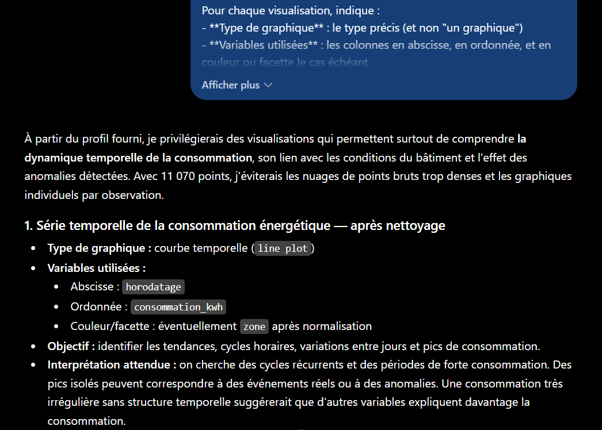

# Partie 6 — Résultats obtenus et analyse

**LLM utilisé :** ChatGPT (OpenAI)
**Date d'exécution :** 12 septembre 2025

---

## 6.1 — Stratégies de nettoyage

**Prompt :** voir [`prompts.md`](prompts.md#61--stratégies-de-nettoyage)
**Contexte fourni :** [`contexte-dataset.md`](contexte-dataset.md) — profil statistique, pas le fichier


La réponse complète est structurée en quatre familles (manquants, doublons, aberrantes, catégorielles), chacune en trois points (détection, traitement, risques), suivie d'un tableau de synthèse en 10 lignes.

### Couverture de la grille : 8/8

| # | Indice | Détecté | Interprétation produite |
|---|---|:---:|---|
| 1 | `temperature_interieure_c` min = -999 | ✅ | « probablement un **code d'erreur** » → NaN puis imputation |
| 2 | Moyenne 15,1 vs médiane 21,0, std 77,3 | ✅ | « le -999 **déforme fortement les statistiques** » |
| 3 | `humidite_pct` max = 317,4 | ✅ | « physiquement suspect », seuil > 100 % → NaN |
| 4 | `consommation_kwh` min = -39,47 | ✅ | « incompatibles avec l'interprétation de la variable cible » |
| 5 | 188 manquantes sur la cible | ✅ | « **ne pas imputer** [...] fabriquer une cible » |
| 6 | 183 vs 270 doublons | ✅ | « une simple déduplication **ne résout pas** le problème des 270 collisions » |
| 7 | 11 modalités de `zone` | ✅ | Table de correspondance explicite vers 5 zones |
| 8 | `type_jour` : 98 vides | ✅ | Reconstruction depuis `horodatage` + calendrier |

**Les trois indices discriminants sont tous traités correctement.**

### Le piège principal est évité

L'indice n° 1 était conçu comme un piège récursif : `-999` corrompt les statistiques (`std` = 77,3) qui serviraient à le détecter. Un modèle appliquant une règle « écarter au-delà de 3 écarts-types » ne l'aurait jamais isolé, puisque `-999` est à 13 écarts-types de la moyenne — mais que cette moyenne est elle-même tirée vers le bas par lui.

Le modèle a raisonné dans le bon ordre :

> « moyenne de **15,108** et un écart-type de **77,325**, **incohérents avec ses quartiles** »

Il compare la moyenne aux quartiles (Q1 20,45 / médiane 21,00 / Q3 21,55), constate l'incohérence, et en déduit la présence d'une valeur sentinelle. **C'est un raisonnement sur la cohérence interne du profil**, pas l'application d'une recette.

Sa conclusion finale l'énonce explicitement :

> « ne pas appliquer aveuglément `dropna()` ou une détection d'outliers statistique »

### La distinction cible / explicatives est correctement appliquée

La contrainte demandait de distinguer les traitements applicables à la cible. Le modèle produit la bonne réponse méthodologique :

> « Pour `consommation_kwh`, qui est la cible, je recommande de **ne pas imputer** les 188 valeurs [...] supprimer ces observations de l'ensemble d'apprentissage est préférable à **fabriquer une cible** »

Et il en tire la conséquence chiffrée : 11 070 → 10 882 observations.

Il va plus loin en identifiant le risque méthodologique sous-jacent :

> « Imputer la cible pourrait **introduire artificiellement une relation** entre les variables explicatives et la consommation. »

C'est exact : imputer une cible à partir des features revient à apprendre au modèle sa propre règle d'imputation.

Même rigueur sur les valeurs extrêmes de la cible — il refuse de winsoriser :

> « Supprimer tous les grands `consommation_kwh` pourrait éliminer de **vrais pics énergétiques, précisément intéressants** pour la prédiction. »

### Les quasi-doublons sont identifiés sans que l'écart soit souligné

Le profil donnait 183 lignes strictement identiques et 270 couples `(horodatage, zone)` dupliqués, **sans commenter l'écart**. Le modèle l'a exploité :

> « Une simple déduplication sur toutes les colonnes **ne résout pas** le problème des 270 collisions non identiques. »

Il refuse par ailleurs la suppression automatique et propose une comparaison ligne à ligne — comportement prudent adapté à un cas où la règle de résolution est inconnue.

### La formule d'incertitude est utilisée cinq fois

La contrainte imposait d'écrire « information non disponible dans le profil » plutôt que de supposer. Elle est employée cinq fois, à chaque fois à bon escient :

| Usage | Ce qui manque réellement |
|---|---|
| Calendrier des jours fériés | ✅ absent du profil |
| Longueur des séquences manquantes | ✅ `isna().sum()` ne la donne pas |
| Règle de résolution des collisions d'`id_releve` | ✅ absente |
| Fréquence des valeurs > 100 % et < 0 | ✅ `describe()` ne donne que min/max |
| Correspondance métier des 5 zones | ✅ absente |

Le quatrième usage est le plus fin : le modèle constate qu'un `describe()` ne permet pas de fixer un seuil de winsorisation, faute de connaître la **fréquence** des valeurs extrêmes — seulement leur existence.

**C'est la cinquième confirmation du principe dégagé en Partie 3** : donner une formule à produire fait émerger l'incertitude, là où une simple interdiction d'inventer la laisserait implicite.

### Deux réserves

**1. L'interpolation temporelle est recommandée sans vérification de faisabilité.** Le modèle propose d'interpoler `temperature_interieure_c`, `humidite_pct` et `occupation_personnes` « sous réserve de disposer de relevés voisins ». La réserve est posée, mais le dataset comporte des doublons de clé `(horodatage, zone)` — l'index temporel n'est donc pas propre au moment où l'interpolation s'appliquerait. L'ordre des opérations (dédupliquer avant d'interpoler) n'est pas explicité.

**2. `occupation_personnes` : l'interpolation est discutable.** Le modèle le signale lui-même (« peut lisser des changements brusques ») mais la retient quand même. Pour une variable de comptage à forte variation horaire — 0 la nuit, pic en journée — une imputation par 0 hors horaires de bureau, ou par la médiane zone × heure, serait mieux adaptée. La réserve est correcte, l'arbitrage discutable.

### Ce que cette tâche établit

**1. Fournir un profil statistique suffit à obtenir des conseils ancrés.** Le modèle n'a jamais eu accès aux 11 070 lignes. Un `describe()`, un `isna()`, un `value_counts()` et 8 lignes d'extrait ont suffi à produire une stratégie de nettoyage complète et spécifique. **C'est le cas d'usage réaliste**, et il fonctionne.

**2. La contrainte d'ancrage transforme la nature de la réponse.** Chaque recommandation cite une colonne et une valeur. Aucune stratégie générique n'est proposée « en général » — contraste net avec la Partie 3, où le prompt vague produisait une vingtaine de recommandations hors-sol.

**3. Le raisonnement sur la cohérence interne du profil est le point fort.** Comparer moyenne et quartiles pour détecter une sentinelle, ou comparer deux compteurs de doublons pour déduire des quasi-doublons, ne s'obtient pas par application de recettes. C'est ce qui distingue ici un conseil expert d'un catalogue.

**4. Le risque « conseil plausible mais inadapté » ne s'est pas matérialisé sur cette tâche** — mais il reste entier sur les questions 6.2 et 6.3, où il n'existe pas de grille de correction objective.

---

## 6.2 — Visualisations pertinentes

**Prompt :** voir [`prompts.md`](prompts.md#62--visualisations-pertinentes)



**Réponse obtenue :** sept visualisations, chacune en cinq points (type, variables, objectif, interprétation, justification), plus un tableau de classement final et une remarque de synthèse sur la lisibilité.

| Rang | Visualisation | Type | Moment |
|---|---|---|---|
| 1 | Série temporelle de la consommation | line plot | après nettoyage |
| 2 | Profil horaire par `type_jour` | line plot + bande IQR | après nettoyage |
| 3 | `occupation_personnes` → consommation | scatter avec transparence | après nettoyage |
| 4 | Distribution par `zone` | boxplot | après **normalisation** |
| 5 | `temperature_interieure_c` → consommation | scatter + tendance | après nettoyage |
| 6 | Matrice de corrélation | heatmap | après nettoyage |
| 7 | `type_jour` × `zone` | grouped boxplot | après nettoyage |

**Observations :**

| Critère | Constat |
|---|---|
| Nombre | ✅ 7, dans la fourchette 5-8 |
| Classement par utilité | ✅ explicite, avec tableau récapitulatif |
| Colonnes existantes uniquement | ✅ aucune colonne inventée |
| Justification par le dataset | ✅ chaque visualisation cite un chiffre du profil |
| Avant / après nettoyage | ⚠️ les 7 sont « après » — voir ci-dessous |
| Lisibilité à 11 070 points | ✅ traitée explicitement |

### Les trois caractéristiques du dataset sont exploitées

| Caractéristique | Exploitation |
|---|---|
| Série horaire sur 90 jours | ✅ visualisations 1 et 2 — série temporelle **et** profil horaire agrégé, deux lectures distinctes du temps |
| 5 zones | ✅ visualisations 4 et 7, avec la condition « après normalisation » rappelée |
| Cible asymétrique | ⚠️ partiellement — voir la limite ci-dessous |

La visualisation n° 2 est la plus fine : un **profil horaire moyen avec bande interquartile**, croisé par `type_jour`. Elle agrège les 11 070 points en 24 positions horaires, ce qui résout à la fois le problème de volume et la question métier (« le bâtiment consomme-t-il différemment le weekend ? »).

La n° 7 va plus loin en cherchant une **interaction** `zone` × `type_jour` — hypothèse pertinente sur un bâtiment tertiaire, où la salle serveur consomme indépendamment de l'occupation alors que les bureaux non.

### La contrainte de lisibilité a produit son effet

Le prompt interdisait toute visualisation illisible à 11 070 points, sans dire laquelle. Le modèle a répondu deux fois :

- en préambule : « j'éviterais les nuages de points bruts trop denses » ;
- en conclusion : « je ne recommande pas de tracer les 11 070 observations sous forme de points **non transparents** ».

Et il applique la règle : la visualisation n° 3 précise « scatter plot **avec transparence** ». La contrainte n'a donc pas seulement été acceptée, elle a modifié les spécifications proposées.

### La limite principale : aucune visualisation « avant nettoyage »

Le prompt demandait d'indiquer « explicitement si une visualisation doit être faite **avant ou après** le nettoyage ». Le modèle a répondu à la question pour chaque visualisation — mais les sept sont « après ».

**C'est une lacune méthodologique réelle.** L'analyse exploratoire sert aussi à *valider le nettoyage*, et le profil contenait trois anomalies qui appelaient chacune une visualisation dédiée :

| Anomalie | Visualisation manquante | Ce qu'elle montrerait |
|---|---|---|
| 62 valeurs à -999 | Histogramme brut de `temperature_interieure_c` | La bimodalité -999 / ~21 °C, preuve visuelle de la sentinelle |
| `humidite_pct` > 100 % | Distribution brute avec ligne à 100 % | Combien de valeurs dépassent, et de combien |
| Pics à 898 kWh | Distribution de la cible en échelle log | Si les extrêmes forment une queue continue ou un groupe isolé |

Ce dernier point touche la troisième caractéristique du dataset : **l'asymétrie de la cible** (moyenne 27,3 / médiane 13,1 / max 898,5) n'a fait l'objet d'aucune visualisation dédiée. Or c'est l'information qui détermine s'il faut transformer la cible en log avant modélisation — décision majeure pour la question 6.3.

**Origine probable :** le modèle a traité « avant ou après nettoyage » comme une **question de validité** (« ce graphique serait-il faussé par les anomalies ? ») plutôt que comme une **invitation à en proposer des deux sortes**. Les sept réponses sont correctes prises une à une ; c'est leur ensemble qui est déséquilibré.

Correction du prompt :

```text
- propose au moins deux visualisations à réaliser AVANT nettoyage, destinées
  à caractériser les anomalies elles-mêmes, et indique ce qu'elles doivent
  montrer pour confirmer ou infirmer chaque hypothèse de nettoyage
```

### Une justification discutable

Pour la visualisation n° 3, le modèle écrit :

> « `occupation_personnes` varie de 0 à 22 et **ne présente pas de valeur manifestement aberrante** dans le profil. »

C'est exact au regard du profil seul, mais incomplet : cette colonne a **527 valeurs manquantes (4,76 %)**, et la question 6.1 avait justement identifié que son imputation était délicate (variable de comptage à forte variation horaire). Une visualisation qui l'utilise en abscisse dépend donc d'un choix d'imputation non trivial — ce qui n'est pas signalé ici.

C'est une illustration de la **perte de contexte entre conversations** : la question 6.1 a été traitée dans une session distincte, et ses conclusions ne sont pas disponibles ici. En usage réel, enchaîner les deux dans une même conversation — ou réinjecter les conclusions du nettoyage — améliorerait la cohérence.

### Ce que cette tâche établit

**1. Sans grille de correction objective, l'évaluation porte sur l'ancrage.** Aucune des sept visualisations n'est « fausse ». Ce qui les distingue d'un catalogue générique, c'est que chacune cite un chiffre du profil pour se justifier — 7 670 jours ouvrés, 11 modalités, écart-type de 77,3.

**2. Une contrainte négative bien posée modifie les spécifications.** « Aucune visualisation illisible à 11 070 points » n'a pas seulement été respectée : elle a fait ajouter « avec transparence » et privilégier les formes agrégées.

**3. Une consigne binaire mal formulée produit une réponse déséquilibrée.** « Indique si c'est avant ou après » invitait à classer, pas à couvrir les deux cas. Pour obtenir une répartition, il faut l'exiger — comme pour le nombre de visualisations, qui était borné explicitement et a été respecté.

**4. L'isolement des conversations a un coût.** Le protocole « une conversation neuve par prompt » garantit l'indépendance des tests, mais prive chaque réponse des conclusions des précédentes. C'est méthodologiquement nécessaire ici, et contre-productif en usage réel.
