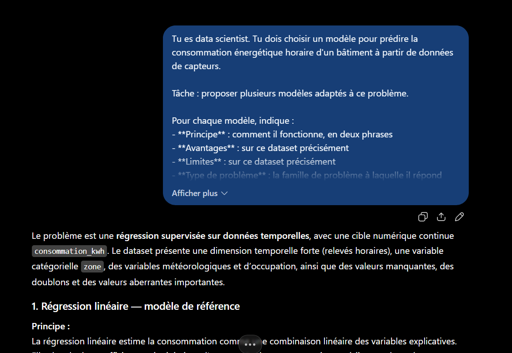
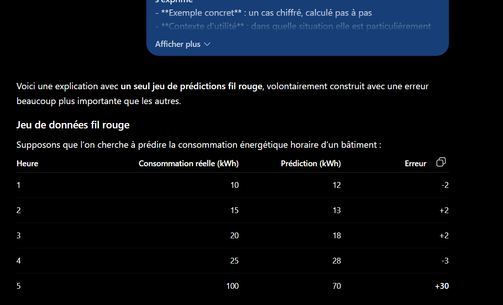

# Partie 6 — Résultats obtenus et analyse

**LLM utilisé :** ChatGPT (OpenAI)
**Date d'exécution :** 12 septembre 2025

---

## 6.1 — Stratégies de nettoyage

**Prompt :** voir [`prompts.md`](prompts.md#61--stratégies-de-nettoyage)
**Contexte fourni :** [`contexte-dataset.md`](contexte-dataset.md) — profil statistique, pas le fichier


La réponse complète est structurée en quatre familles (manquants, doublons, aberrantes, catégorielles), chacune en trois points (détection, traitement, risques), suivie d'un tableau de synthèse en 10 lignes.

### Couverture de la grille : 8/8

| # | Indice | Détecté | Interprétation produite |
|---|---|:---:|---|
| 1 | `temperature_interieure_c` min = -999 | ✅ | « probablement un **code d'erreur** » → NaN puis imputation |
| 2 | Moyenne 15,1 vs médiane 21,0, std 77,3 | ✅ | « le -999 **déforme fortement les statistiques** » |
| 3 | `humidite_pct` max = 317,4 | ✅ | « physiquement suspect », seuil > 100 % → NaN |
| 4 | `consommation_kwh` min = -39,47 | ✅ | « incompatibles avec l'interprétation de la variable cible » |
| 5 | 188 manquantes sur la cible | ✅ | « **ne pas imputer** [...] fabriquer une cible » |
| 6 | 183 vs 270 doublons | ✅ | « une simple déduplication **ne résout pas** le problème des 270 collisions » |
| 7 | 11 modalités de `zone` | ✅ | Table de correspondance explicite vers 5 zones |
| 8 | `type_jour` : 98 vides | ✅ | Reconstruction depuis `horodatage` + calendrier |

**Les trois indices discriminants sont tous traités correctement.**

### Le piège principal est évité

L'indice n° 1 était conçu comme un piège récursif : `-999` corrompt les statistiques (`std` = 77,3) qui serviraient à le détecter. Un modèle appliquant une règle « écarter au-delà de 3 écarts-types » ne l'aurait jamais isolé, puisque `-999` est à 13 écarts-types de la moyenne — mais que cette moyenne est elle-même tirée vers le bas par lui.

Le modèle a raisonné dans le bon ordre :

> « moyenne de **15,108** et un écart-type de **77,325**, **incohérents avec ses quartiles** »

Il compare la moyenne aux quartiles (Q1 20,45 / médiane 21,00 / Q3 21,55), constate l'incohérence, et en déduit la présence d'une valeur sentinelle. **C'est un raisonnement sur la cohérence interne du profil**, pas l'application d'une recette.

Sa conclusion finale l'énonce explicitement :

> « ne pas appliquer aveuglément `dropna()` ou une détection d'outliers statistique »

### La distinction cible / explicatives est correctement appliquée

La contrainte demandait de distinguer les traitements applicables à la cible. Le modèle produit la bonne réponse méthodologique :

> « Pour `consommation_kwh`, qui est la cible, je recommande de **ne pas imputer** les 188 valeurs [...] supprimer ces observations de l'ensemble d'apprentissage est préférable à **fabriquer une cible** »

Et il en tire la conséquence chiffrée : 11 070 → 10 882 observations.

Il va plus loin en identifiant le risque méthodologique sous-jacent :

> « Imputer la cible pourrait **introduire artificiellement une relation** entre les variables explicatives et la consommation. »

C'est exact : imputer une cible à partir des features revient à apprendre au modèle sa propre règle d'imputation.

Même rigueur sur les valeurs extrêmes de la cible — il refuse de winsoriser :

> « Supprimer tous les grands `consommation_kwh` pourrait éliminer de **vrais pics énergétiques, précisément intéressants** pour la prédiction. »

### Les quasi-doublons sont identifiés sans que l'écart soit souligné

Le profil donnait 183 lignes strictement identiques et 270 couples `(horodatage, zone)` dupliqués, **sans commenter l'écart**. Le modèle l'a exploité :

> « Une simple déduplication sur toutes les colonnes **ne résout pas** le problème des 270 collisions non identiques. »

Il refuse par ailleurs la suppression automatique et propose une comparaison ligne à ligne — comportement prudent adapté à un cas où la règle de résolution est inconnue.

### La formule d'incertitude est utilisée cinq fois

La contrainte imposait d'écrire « information non disponible dans le profil » plutôt que de supposer. Elle est employée cinq fois, à chaque fois à bon escient :

| Usage | Ce qui manque réellement |
|---|---|
| Calendrier des jours fériés | ✅ absent du profil |
| Longueur des séquences manquantes | ✅ `isna().sum()` ne la donne pas |
| Règle de résolution des collisions d'`id_releve` | ✅ absente |
| Fréquence des valeurs > 100 % et < 0 | ✅ `describe()` ne donne que min/max |
| Correspondance métier des 5 zones | ✅ absente |

Le quatrième usage est le plus fin : le modèle constate qu'un `describe()` ne permet pas de fixer un seuil de winsorisation, faute de connaître la **fréquence** des valeurs extrêmes — seulement leur existence.

**C'est la cinquième confirmation du principe dégagé en Partie 3** : donner une formule à produire fait émerger l'incertitude, là où une simple interdiction d'inventer la laisserait implicite.

### Deux réserves

**1. L'interpolation temporelle est recommandée sans vérification de faisabilité.** Le modèle propose d'interpoler `temperature_interieure_c`, `humidite_pct` et `occupation_personnes` « sous réserve de disposer de relevés voisins ». La réserve est posée, mais le dataset comporte des doublons de clé `(horodatage, zone)` — l'index temporel n'est donc pas propre au moment où l'interpolation s'appliquerait. L'ordre des opérations (dédupliquer avant d'interpoler) n'est pas explicité.

**2. `occupation_personnes` : l'interpolation est discutable.** Le modèle le signale lui-même (« peut lisser des changements brusques ») mais la retient quand même. Pour une variable de comptage à forte variation horaire — 0 la nuit, pic en journée — une imputation par 0 hors horaires de bureau, ou par la médiane zone × heure, serait mieux adaptée. La réserve est correcte, l'arbitrage discutable.

### Ce que cette tâche établit

**1. Fournir un profil statistique suffit à obtenir des conseils ancrés.** Le modèle n'a jamais eu accès aux 11 070 lignes. Un `describe()`, un `isna()`, un `value_counts()` et 8 lignes d'extrait ont suffi à produire une stratégie de nettoyage complète et spécifique. **C'est le cas d'usage réaliste**, et il fonctionne.

**2. La contrainte d'ancrage transforme la nature de la réponse.** Chaque recommandation cite une colonne et une valeur. Aucune stratégie générique n'est proposée « en général » — contraste net avec la Partie 3, où le prompt vague produisait une vingtaine de recommandations hors-sol.

**3. Le raisonnement sur la cohérence interne du profil est le point fort.** Comparer moyenne et quartiles pour détecter une sentinelle, ou comparer deux compteurs de doublons pour déduire des quasi-doublons, ne s'obtient pas par application de recettes. C'est ce qui distingue ici un conseil expert d'un catalogue.

**4. Le risque « conseil plausible mais inadapté » ne s'est pas matérialisé sur cette tâche** — mais il reste entier sur les questions 6.2 et 6.3, où il n'existe pas de grille de correction objective.

---

## 6.2 — Visualisations pertinentes

**Prompt :** voir [`prompts.md`](prompts.md#62--visualisations-pertinentes)


**Réponse obtenue :** sept visualisations, chacune en cinq points (type, variables, objectif, interprétation, justification), plus un tableau de classement final et une remarque de synthèse sur la lisibilité.

| Rang | Visualisation | Type | Moment |
|---|---|---|---|
| 1 | Série temporelle de la consommation | line plot | après nettoyage |
| 2 | Profil horaire par `type_jour` | line plot + bande IQR | après nettoyage |
| 3 | `occupation_personnes` → consommation | scatter avec transparence | après nettoyage |
| 4 | Distribution par `zone` | boxplot | après **normalisation** |
| 5 | `temperature_interieure_c` → consommation | scatter + tendance | après nettoyage |
| 6 | Matrice de corrélation | heatmap | après nettoyage |
| 7 | `type_jour` × `zone` | grouped boxplot | après nettoyage |

**Observations :**

| Critère | Constat |
|---|---|
| Nombre | ✅ 7, dans la fourchette 5-8 |
| Classement par utilité | ✅ explicite, avec tableau récapitulatif |
| Colonnes existantes uniquement | ✅ aucune colonne inventée |
| Justification par le dataset | ✅ chaque visualisation cite un chiffre du profil |
| Avant / après nettoyage | ⚠️ les 7 sont « après » — voir ci-dessous |
| Lisibilité à 11 070 points | ✅ traitée explicitement |

### Les trois caractéristiques du dataset sont exploitées

| Caractéristique | Exploitation |
|---|---|
| Série horaire sur 90 jours | ✅ visualisations 1 et 2 — série temporelle **et** profil horaire agrégé, deux lectures distinctes du temps |
| 5 zones | ✅ visualisations 4 et 7, avec la condition « après normalisation » rappelée |
| Cible asymétrique | ⚠️ partiellement — voir la limite ci-dessous |

La visualisation n° 2 est la plus fine : un **profil horaire moyen avec bande interquartile**, croisé par `type_jour`. Elle agrège les 11 070 points en 24 positions horaires, ce qui résout à la fois le problème de volume et la question métier (« le bâtiment consomme-t-il différemment le weekend ? »).

La n° 7 va plus loin en cherchant une **interaction** `zone` × `type_jour` — hypothèse pertinente sur un bâtiment tertiaire, où la salle serveur consomme indépendamment de l'occupation alors que les bureaux non.

### La contrainte de lisibilité a produit son effet

Le prompt interdisait toute visualisation illisible à 11 070 points, sans dire laquelle. Le modèle a répondu deux fois :

- en préambule : « j'éviterais les nuages de points bruts trop denses » ;
- en conclusion : « je ne recommande pas de tracer les 11 070 observations sous forme de points **non transparents** ».

Et il applique la règle : la visualisation n° 3 précise « scatter plot **avec transparence** ». La contrainte n'a donc pas seulement été acceptée, elle a modifié les spécifications proposées.

### La limite principale : aucune visualisation « avant nettoyage »

Le prompt demandait d'indiquer « explicitement si une visualisation doit être faite **avant ou après** le nettoyage ». Le modèle a répondu à la question pour chaque visualisation — mais les sept sont « après ».

**C'est une lacune méthodologique réelle.** L'analyse exploratoire sert aussi à *valider le nettoyage*, et le profil contenait trois anomalies qui appelaient chacune une visualisation dédiée :

| Anomalie | Visualisation manquante | Ce qu'elle montrerait |
|---|---|---|
| 62 valeurs à -999 | Histogramme brut de `temperature_interieure_c` | La bimodalité -999 / ~21 °C, preuve visuelle de la sentinelle |
| `humidite_pct` > 100 % | Distribution brute avec ligne à 100 % | Combien de valeurs dépassent, et de combien |
| Pics à 898 kWh | Distribution de la cible en échelle log | Si les extrêmes forment une queue continue ou un groupe isolé |

Ce dernier point touche la troisième caractéristique du dataset : **l'asymétrie de la cible** (moyenne 27,3 / médiane 13,1 / max 898,5) n'a fait l'objet d'aucune visualisation dédiée. Or c'est l'information qui détermine s'il faut transformer la cible en log avant modélisation — décision majeure pour la question 6.3.

**Origine probable :** le modèle a traité « avant ou après nettoyage » comme une **question de validité** (« ce graphique serait-il faussé par les anomalies ? ») plutôt que comme une **invitation à en proposer des deux sortes**. Les sept réponses sont correctes prises une à une ; c'est leur ensemble qui est déséquilibré.

Correction du prompt :

```text
- propose au moins deux visualisations à réaliser AVANT nettoyage, destinées
  à caractériser les anomalies elles-mêmes, et indique ce qu'elles doivent
  montrer pour confirmer ou infirmer chaque hypothèse de nettoyage
```

### Une justification discutable

Pour la visualisation n° 3, le modèle écrit :

> « `occupation_personnes` varie de 0 à 22 et **ne présente pas de valeur manifestement aberrante** dans le profil. »

C'est exact au regard du profil seul, mais incomplet : cette colonne a **527 valeurs manquantes (4,76 %)**, et la question 6.1 avait justement identifié que son imputation était délicate (variable de comptage à forte variation horaire). Une visualisation qui l'utilise en abscisse dépend donc d'un choix d'imputation non trivial — ce qui n'est pas signalé ici.

C'est une illustration de la **perte de contexte entre conversations** : la question 6.1 a été traitée dans une session distincte, et ses conclusions ne sont pas disponibles ici. En usage réel, enchaîner les deux dans une même conversation — ou réinjecter les conclusions du nettoyage — améliorerait la cohérence.

### Ce que cette tâche établit

**1. Sans grille de correction objective, l'évaluation porte sur l'ancrage.** Aucune des sept visualisations n'est « fausse ». Ce qui les distingue d'un catalogue générique, c'est que chacune cite un chiffre du profil pour se justifier — 7 670 jours ouvrés, 11 modalités, écart-type de 77,3.

**2. Une contrainte négative bien posée modifie les spécifications.** « Aucune visualisation illisible à 11 070 points » n'a pas seulement été respectée : elle a fait ajouter « avec transparence » et privilégier les formes agrégées.

**3. Une consigne binaire mal formulée produit une réponse déséquilibrée.** « Indique si c'est avant ou après » invitait à classer, pas à couvrir les deux cas. Pour obtenir une répartition, il faut l'exiger — comme pour le nombre de visualisations, qui était borné explicitement et a été respecté.

**4. L'isolement des conversations a un coût.** Le protocole « une conversation neuve par prompt » garantit l'indépendance des tests, mais prive chaque réponse des conclusions des précédentes. C'est méthodologiquement nécessaire ici, et contre-productif en usage réel.

---

## 6.3 — Modèles de prédiction

**Prompt :** voir [`prompts.md`](prompts.md#63--modèles-de-prédiction)



**Réponse obtenue :** cinq modèles, chacun en cinq points (principe, avantages, limites, type de problème, métriques) plus un prétraitement, suivis d'une section dédiée à la construction du jeu de test et d'une recommandation finale.

| # | Modèle | Rôle |
|---|---|---|
| 1 | Régression linéaire | **Baseline** explicitement nommé |
| 2 | Random Forest Regressor | Non-linéaire, interactions |
| 3 | XGBoost / Gradient Boosting | **Candidat principal retenu** |
| 4 | SARIMAX | Série temporelle + exogènes |
| 5 | LSTM | Séquentiel profond |

### Point décisif n° 1 : le split temporel est correct

C'était le test principal de la question. La contrainte disait seulement « en tenant compte de la nature des données », sans souffler la réponse. Le modèle a produit exactement ce qu'il fallait :

> « Il ne faut surtout **pas faire un `train_test_split` aléatoire**, car cela mélangerait passé et futur et créerait une **fuite temporelle**. »

Et il propose un découpage chronologique chiffré :

| Ensemble | Période | Rôle |
|---|---|---|
| Train | 1er janvier → 15 mars | apprentissage |
| Validation | 16 → 23 mars | hyperparamètres |
| Test | 24 → 31 mars | évaluation finale |

Avec la règle générale correctement énoncée — « le jeu de test doit contenir uniquement des observations **postérieures** aux données d'entraînement » — et la mention de la **validation walk-forward / `TimeSeriesSplit`** pour les modèles temporels.

**Le risque annoncé dans le [cadrage](README.md#1-ce-qui-change-dans-cette-partie) — le conseil plausible mais inadapté — ne s'est pas matérialisé.** Une validation croisée classique aurait été la réponse « par défaut » sur un dataset tabulaire ; le modèle a identifié que la structure horaire l'interdit.

### Point décisif n° 2 : cohérence type de problème ↔ métriques

La réponse s'ouvre par la qualification du problème :

> « régression supervisée sur données temporelles, avec une cible numérique continue `consommation_kwh` »

Et **aucune métrique de classification n'apparaît** dans les cinq modèles. Les métriques citées sont MAE, RMSE, R², plus MAPE pour les deux modèles temporels — avec à chaque fois la même réserve :

> « **MAPE**, avec prudence : elle devient problématique lorsque la consommation est nulle ou proche de zéro. »

Cette réserve est fondée sur le profil : `consommation_kwh` a un minimum négatif et un premier quartile à 10,29, donc des valeurs proches de zéro existent. MAPE y diverge. **Le modèle a relié une limite mathématique connue à une caractéristique observée du dataset** — exactement le type d'ancrage que le prompt exigeait.

Il justifie aussi le choix RMSE par le dataset :

> « RMSE : pénalise davantage les grosses erreurs, particulièrement important ici puisque la consommation atteint des **valeurs extrêmes**. »

### Les limites sont spécifiques, pas génériques

La contrainte « limites **sur ce dataset précisément** » a produit son effet. Trois exemples :

| Modèle | Limite citée | Ancrage |
|---|---|---|
| Random Forest | « avec seulement **90 jours**, difficultés à généraliser certains comportements saisonniers » | ✅ durée réelle du dataset |
| SARIMAX | « les **multiples zones** compliquent un SARIMAX unique : il faudrait travailler par zone » | ✅ structure à 5 zones |
| LSTM | « **11 070 lignes sur 90 jours** constituent un volume assez limité pour un réseau profond » | ✅ volume réel |

La limite du LSTM est la plus utile : le modèle recommande explicitement de **ne pas** partir sur du deep learning, en justifiant par le volume et en notant qu'« un XGBoost bien construit peut facilement être plus performant sur ce type de dataset tabulaire ». C'est un conseil de sobriété, pas une énumération de tout ce qui existe.

### Le feature engineering temporel est proposé spontanément

Le prompt ne demandait pas de variables dérivées. Le modèle en propose à plusieurs reprises :

- extraction depuis `horodatage` : heure, jour de la semaine, mois ;
- variables retardées explicites : `consommation_lag_1h`, `consommation_lag_24h`, `consommation_lag_168h`.

Les trois retards choisis correspondent aux trois saisonnalités attendues d'un bâtiment tertiaire : heure précédente, même heure la veille, même heure la semaine précédente. **C'est une proposition experte, non demandée**, et cohérente avec la limite qu'il identifie pour les modèles d'arbres (« ne comprend pas intrinsèquement la notion d'ordre temporel »).

### La cible manquante est de nouveau correctement traitée

Sans que le prompt le demande, le modèle consacre une section aux 188 valeurs manquantes de la cible :

> « ces lignes ne peuvent pas servir directement à entraîner ou évaluer le modèle »

C'est cohérent avec la réponse de la question 6.1, obtenue dans une conversation distincte. **La convergence entre deux sessions indépendantes suggère que le profil du dataset porte suffisamment d'information pour que ce raisonnement soit reproductible.**

### Deux limites

**1. L'asymétrie de la cible n'est pas exploitée.** Le profil donne moyenne 27,27, médiane 13,06, écart-type 71,73, max 898,52 — soit une distribution fortement asymétrique à queue longue. Aucun des cinq modèles ne propose de **transformation logarithmique de la cible**, alors que c'est un traitement standard dans ce cas et qu'il change significativement le comportement de RMSE.

Le modèle mentionne les « valeurs extrêmes » pour justifier RMSE, mais n'en tire pas la conséquence en amont : faut-il apprendre sur `log(consommation)` ? C'est la même information que la question 6.2 avait laissée de côté — l'asymétrie est vue, jamais traitée.

**2. R² est proposé sans réserve.** Sur une série temporelle, R² se compare mal entre périodes de variance différente, et un R² élevé peut masquer un modèle qui ne fait que reproduire la saisonnalité. Un baseline de persistance (« prédire la valeur de l'heure précédente ») aurait été un point de comparaison plus exigeant que la régression linéaire proposée.

### Ce que cette tâche établit

**1. Le risque principal de la partie 6 ne s'est pas matérialisé.** Le conseil inadapté attendu — validation croisée aléatoire sur série temporelle — a été explicitement écarté. Sur ce dataset, le profil fourni contenait assez d'indices (horodatage horaire, 90 jours) pour que le modèle infère la contrainte méthodologique.

**2. Exiger de qualifier le problème avant de citer les métriques a produit la cohérence voulue.** Aucune métrique de classification n'apparaît. La séquence imposée dans le prompt — type de problème d'abord, métriques ensuite — semble avoir joué le rôle d'une vérification interne.

**3. Une contrainte « sur ce dataset précisément » répétée à chaque rubrique évite le catalogue.** Les cinq modèles sont standards, mais leurs avantages et limites sont chiffrés sur le cas réel. C'est la différence entre une liste Wikipédia et un conseil.

**4. Ce que le modèle voit, il ne le traite pas toujours.** L'asymétrie de la cible est mentionnée deux fois comme justification, jamais comme problème à traiter. **Signaler une caractéristique et en tirer une action sont deux choses distinctes** — il faut demander la seconde explicitement.

---

## 6.4 — Métriques de classification

**Prompt :** voir [`prompts.md`](prompts.md#64--métriques-de-classification)


**Exemple fil rouge produit :** détection de fraude bancaire sur 1 000 transactions.

|  | Réalité : fraude | Réalité : normale |
|---|---:|---:|
| **Prédit : fraude** | TP = 70 | FP = 30 |
| **Prédit : normale** | FN = 30 | TN = 870 |
| **Total** | 100 | 900 |

### Vérification des calculs

Tous les calculs ont été recalculés indépendamment :

| Métrique | Formule appliquée | Valeur calculée | Annoncée | ✓ |
|---|---|---|---|---|
| Accuracy | (70+870)/1000 | 0,9400 | 0,94 | ✅ |
| Precision | 70/(70+30) | 0,7000 | 0,70 | ✅ |
| Recall | 70/(70+30) | 0,7000 | 0,70 | ✅ |
| F1 | 2×0,7×0,7/(0,7+0,7) | 0,7000 | 0,70 | ✅ |
| FPR | 30/(30+870) | 0,0333 | 3,33 % | ✅ |

**Contre-exemples :**

| Cas | Calcul | Annoncé | ✓ |
|---|---|---|---|
| Toujours « normale » | 900/1000 = 0,90 | 90 % | ✅ |
| Conservateur (TP=9, FP=1) | Precision = 0,90 | 90 % | ✅ |
| Tout positif (TP=100, FP=900) | Recall = 1,00 | 100 % | ✅ |
| **F1 avec P=0,9 et R=0,1** | **2×0,9×0,1/1,0 = 0,1800** | **16,4 %** | ❌ |

### L'erreur détectée

Un seul calcul est faux, dans l'illustration de la moyenne harmonique :

> « Precision = 90 %, Recall = 10 % donne : **F1 ≈ 16,4 %** »

La valeur exacte est **18,0 %** :

```
F1 = 2 × (0,9 × 0,1) / (0,9 + 0,1) = 2 × 0,09 / 1,0 = 0,18
```

**L'erreur est mineure sur le fond** — 16,4 % ou 18 %, la démonstration reste valide : le F1 s'effondre quand une des deux composantes est faible, contrairement à une moyenne arithmétique qui donnerait 50 %.

**Mais elle est significative sur la forme.** C'est exactement le risque annoncé dans l'[hypothèse du prompt](prompts.md#64--métriques-de-classification) : sur un sujet très documenté, le modèle produit une réponse fluide et pédagogiquement solide **contenant une erreur de calcul qu'un lecteur non vigilant reprendra telle quelle**. Les cinq calculs principaux étaient exacts ; c'est le sixième, présenté en passant, qui dérape.

Un enseignement opérationnel : **toute valeur numérique produite par un LLM dans un contenu pédagogique doit être recalculée**, même quand les calculs voisins sont justes.

### Les trois pièges anticipés sont évités

| Piège | Traitement dans la réponse |
|---|---|
| Confusion Precision / Recall | ✅ Formules correctes et distinctes, chacune introduite par la question à laquelle elle répond |
| Accuracy présentée comme fiable | ✅ Contre-exemple chiffré : 90 % d'Accuracy pour 0 % de fraudes détectées |
| ROC-AUC sur données déséquilibrées | ✅ **PR-AUC explicitement recommandée** |

Le premier piège est bien désamorcé par un procédé pédagogique efficace : chaque métrique est introduite par sa **question métier** avant sa formule.

> Precision : « Parmi les transactions que le modèle a déclarées frauduleuses, combien le sont réellement ? »
> Recall : « Parmi toutes les transactions réellement frauduleuses, combien le modèle réussit-il à détecter ? »

Cette formulation rend la confusion structurellement difficile : le dénominateur découle de la question posée.

Le troisième piège est celui que la plupart des présentations manquent. La réponse le traite correctement :

> « Elle peut être particulièrement trompeuse avec des classes fortement déséquilibrées [...] il est souvent intéressant de regarder également la **Precision-Recall curve et la PR-AUC**. »

### La contrainte « où s'y fier seule serait une erreur » a produit cinq contre-exemples chiffrés

C'est la contrainte la plus productive du prompt. Chaque métrique est accompagnée d'un cas de défaillance construit :

| Métrique | Contre-exemple |
|---|---|
| Accuracy | Prédire toujours « normale » → 90 %, 0 fraude détectée |
| Precision | Ne signaler que 10 transactions → 90 %, 91 % des fraudes ratées |
| Recall | Tout déclarer positif → 100 %, 900 fausses alertes |
| F1 | Équilibre imposé alors que FN et FP ont des coûts différents |
| ROC-AUC | Bon classement global, inexploitable au seuil réellement utilisé |

Ces contre-exemples ne sont pas décoratifs : ils sont **calculés sur des matrices de confusion cohérentes** avec l'exemple fil rouge. La contrainte « même exemple fil rouge » a permis cette continuité.

### Une limite du cadrage

Le prompt exigeait « un cas déséquilibré, où la classe positive est minoritaire ». Le modèle a produit un déséquilibre de **10 %** (100 fraudes sur 1 000).

C'est effectivement minoritaire, mais **modéré**. Dans la détection de fraude réelle, le taux est plutôt de 0,1 % à 1 %. Avec 10 %, l'Accuracy du modèle trivial atteint 90 % — déjà démonstratif, mais moins spectaculaire qu'avec 2 % de positifs, où elle atteindrait 98 %.

La contrainte aurait gagné à être chiffrée : *« la classe positive représente au maximum 2 % des observations »*. C'est la même leçon qu'en 6.2 : **une contrainte qualitative laisse au modèle le choix du degré**.

### Ce que cette tâche établit

**1. Sur un sujet très documenté, la fluidité masque les erreurs de calcul.** La réponse est pédagogiquement excellente — structure, formules correctes, contre-exemples pertinents, PR-AUC mentionnée. Et elle contient une valeur fausse. **La qualité rédactionnelle n'est pas un indicateur de l'exactitude numérique.**

**2. Introduire une métrique par sa question métier prévient la confusion Precision/Recall.** Le procédé mérite d'être repris dans tout prompt pédagogique sur ce sujet.

**3. Exiger un cas de défaillance par élément est très productif.** Cinq contre-exemples chiffrés et cohérents, là où une demande d'« explication » aurait produit cinq définitions.

**4. Une contrainte qualitative sur un ordre de grandeur doit être chiffrée.** « Cas déséquilibré » a donné 10 % ; « au maximum 2 % » aurait donné une démonstration plus nette.

---

## 6.5 — Métriques de régression

**Prompt :** voir [`prompts.md`](prompts.md#65--métriques-de-régression)



**Jeu fil rouge produit :**

| Heure | Réel (kWh) | Prédit (kWh) | Erreur |
|---|---:|---:|---:|
| 1 | 10 | 12 | −2 |
| 2 | 15 | 13 | +2 |
| 3 | 20 | 18 | +2 |
| 4 | 25 | 28 | −3 |
| 5 | **100** | **70** | **+30** |

### Vérification des calculs : tous exacts

| Métrique | Calcul vérifié | Annoncé | ✓ |
|---|---|---|---|
| MAE | 39/5 = 7,80 | 7,8 kWh | ✅ |
| MSE | 921/5 = 184,20 | 184,2 kWh² | ✅ |
| RMSE | √184,2 = 13,5720 | ≈ 13,57 kWh | ✅ |
| Ratio 30²/2² | 900/4 = 225 | 225 | ✅ |
| Cohérence réel − prédit | 5 lignes sur 5 | — | ✅ |

**Contraste avec la question 6.4**, où une valeur était fausse. Ici les cinq vérifications passent, y compris la cohérence interne du tableau (chaque erreur correspond bien à `réel − prédit`).

Cette différence est instructive : le prompt 6.5 exigeait « **calcule effectivement** les trois valeurs [...] et **montre le détail du calcul** ». Le prompt 6.4 demandait « un exemple concret, avec les nombres de vrais/faux positifs et négatifs » — sans exiger le détail. **Demander le détail du calcul semble réduire le risque d'erreur**, probablement parce qu'il force une décomposition explicite plutôt qu'une restitution mémorisée.

C'est une observation à confirmer sur plus d'exécutions, mais elle est cohérente avec le principe général de la [Partie 3](../03-raisonnement/resultats.md) : décomposer rend vérifiable, et ici, rend aussi plus exact.

### Les unités sont traitées correctement

C'est le point techniquement le plus souvent manqué, et il est bien traité :

> « Comme les erreurs sont élevées au carré, la MSE est en **kWh²**. [...] Une MSE de 184,2 ne signifie donc **pas** que le modèle se trompe de 184,2 kWh. »

La mise en garde est explicite et correcte. Le tableau comparatif reprend l'unité de chacune des trois métriques.

Le modèle formule aussi une nuance rarement énoncée sur RMSE :

> « Il faut cependant éviter de l'interpréter exactement comme une "erreur moyenne", car la RMSE donne davantage de poids aux grandes erreurs. »

C'est exact : RMSE n'est pas une moyenne d'erreurs, c'est une moyenne quadratique — et la confusion est fréquente.

### L'écart MAE ↔ RMSE est correctement diagnostiqué

La contrainte demandait d'expliquer ce que révèle cet écart. La réponse produit la bonne règle, avec la bonne réserve :

> **MAE proche de RMSE** → erreurs relativement homogènes
> **RMSE nettement supérieure à MAE** → présence probable de grosses erreurs
>
> « Attention : ce n'est pas une règle absolue permettant de déduire toute la distribution des erreurs, mais c'est un **signal diagnostique utile**. »

Sur l'exemple, l'écart est frappant : MAE 7,8 contre RMSE 13,57, soit un rapport de 1,74 pour une seule erreur aberrante sur cinq. La construction du jeu fil rouge — imposée par la contrainte « au moins une erreur nettement plus grande » — rend la démonstration visible.

Le modèle quantifie aussi l'effet du carré : une erreur de 30 pèse **225 fois** plus qu'une erreur de 2. C'est le chiffre qui explique tout le reste.

### Le rattachement au dataset est nuancé et correct

C'est la contrainte la plus exigeante du prompt, et la réponse ne se contente pas d'une règle :

> « Je choisirais la **RMSE comme métrique principale**, mais je suivrais également la **MAE**. »

L'argumentation repose sur les chiffres réels du dataset :

| Argument | Ancrage |
|---|---|
| Pics de consommation attendus | moyenne 27,3 ≫ médiane 13,1, max 898,5 |
| RMSE pénalise les erreurs sur les pics | « une erreur de 400 kWh sur un pic ne doit pas être équivalente à 10 kWh en période normale » |
| Mais RMSE seule serait dominée par les extrêmes | « quelques valeurs extrêmes pourraient dominer la RMSE » |
| Donc MAE en complément | « vérifier la performance courante du modèle » |

Et il ajoute une recommandation opérationnelle non demandée : « j'analyserais séparément les erreurs sur les **heures de pointe** ». C'est le bon réflexe sur une distribution asymétrique — segmenter l'évaluation plutôt que chercher une métrique unique.

**Le modèle répond bien qu'il s'agit d'un arbitrage, pas d'une règle technique.** Il ne tranche pas abstraitement entre MAE et RMSE : il propose un dispositif de mesure adapté au profil de la cible.

### Une occasion manquée

Le contexte fourni signalait explicitement la distribution asymétrique. Comme en 6.2 et 6.3, **la transformation logarithmique de la cible n'est pas évoquée**.

C'est pourtant ici qu'elle aurait le plus de sens : si l'on entraîne sur `log(consommation)`, RMSE mesure une erreur relative plutôt qu'absolue, ce qui change complètement l'arbitrage MAE/RMSE. Le modèle raisonne sur *comment mesurer* l'erreur sur une cible asymétrique, sans jamais envisager de *transformer* cette cible.

**Troisième occurrence du même angle mort dans la partie 6.** L'asymétrie est systématiquement reconnue et utilisée comme argument, jamais traitée comme une décision de modélisation.

### Ce que cette tâche établit

**1. Exiger le détail du calcul améliore l'exactitude.** Cinq vérifications exactes en 6.5 contre une erreur en 6.4, sur des tâches de difficulté comparable. La différence de formulation entre les deux prompts est la piste la plus plausible.

**2. Les unités sont un bon révélateur de compréhension.** Distinguer kWh de kWh², et prévenir la mauvaise lecture de la MSE, suppose de comprendre l'opération, pas de restituer une formule.

**3. Un bon conseil métrique est un dispositif, pas un choix unique.** RMSE principale + MAE complémentaire + analyse séparée des pics : c'est plus utile qu'une réponse tranchée, et c'est ce que la contrainte « laquelle choisirais-tu **et pourquoi** » a permis d'obtenir.

---

# Synthèse de la Partie 6

## Grille récapitulative

| Tâche | Ancrage | Couverture | Exactitude | Spécificité | Cohérence |
|---|---|---|---|---|---|
| 6.1 Nettoyage | ✅ chaque reco cite une colonne | ✅ **8/8** indices | ✅ | ✅ | ✅ |
| 6.2 Visualisations | ✅ chaque viz cite un chiffre | ⚠️ aucune « avant nettoyage » | ✅ | ✅ | ✅ |
| 6.3 Modèles | ✅ limites chiffrées | ✅ 5 modèles + baseline | ✅ | ✅ | ✅ split temporel |
| 6.4 Métriques classif. | n/a | ✅ 5/5 | ❌ **1 erreur** (F1 = 18 %, pas 16,4 %) | ✅ | ✅ |
| 6.5 Métriques régression | ✅ dataset cité | ✅ 3/3 | ✅ tout vérifié | ✅ | ✅ |

## Enseignements

**1. Le risque annoncé — le conseil plausible mais inadapté — ne s'est pas matérialisé.** Les deux pièges méthodologiques majeurs ont été évités : la sentinelle `-999` n'a pas été traitée comme un outlier statistique (6.1), et le split aléatoire sur série temporelle a été explicitement rejeté (6.3). Sur ce dataset, un profil statistique bien construit a suffi.

**2. Un profil statistique remplace le dataset.** Le modèle n'a jamais vu les 11 070 lignes. Un `describe()`, un `isna()`, un `value_counts()` et 8 lignes d'extrait ont produit des conseils spécifiques et exploitables. **C'est le cas d'usage réaliste du LLM en data science**, et il fonctionne.

**3. La contrainte d'ancrage est ce qui sépare le conseil du catalogue.** Exiger que chaque recommandation cite une colonne et une valeur a produit, dans les trois premières tâches, des réponses impossibles à confondre avec un cours générique. Contraste net avec la Partie 3, où le prompt vague donnait une vingtaine de recommandations hors-sol.

**4. La fluidité masque les erreurs de calcul.** L'erreur du F1 (6.4) est passée inaperçue à la lecture : la réponse était structurée, les formules justes, les contre-exemples pertinents. **Toute valeur numérique produite par un LLM doit être recalculée**, même entourée de calculs exacts.

**5. Exiger le détail du calcul semble réduire le risque d'erreur.** Seule différence de formulation entre 6.4 (une erreur) et 6.5 (aucune) : « montre le détail du calcul ». À confirmer, mais cohérent avec ce qu'a établi la Partie 3 sur la décomposition.

**6. Signaler une caractéristique n'est pas la traiter.** L'asymétrie de la cible a été mentionnée dans les trois tâches concernées (6.2, 6.3, 6.5), toujours comme argument, jamais comme décision : **aucune transformation logarithmique n'a été proposée**. Pour obtenir une action, il faut la demander — « quelles transformations de la cible envisages-tu, et pourquoi ? ».

**7. Une contrainte qualitative laisse le degré au modèle.** « Cas déséquilibré » a donné 10 % de positifs là où 2 % aurait été plus démonstratif ; « indique avant ou après nettoyage » a produit sept « après ». Quand l'ordre de grandeur ou la répartition comptent, il faut les chiffrer.
