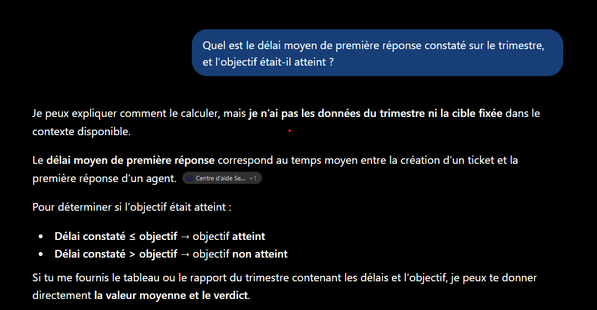
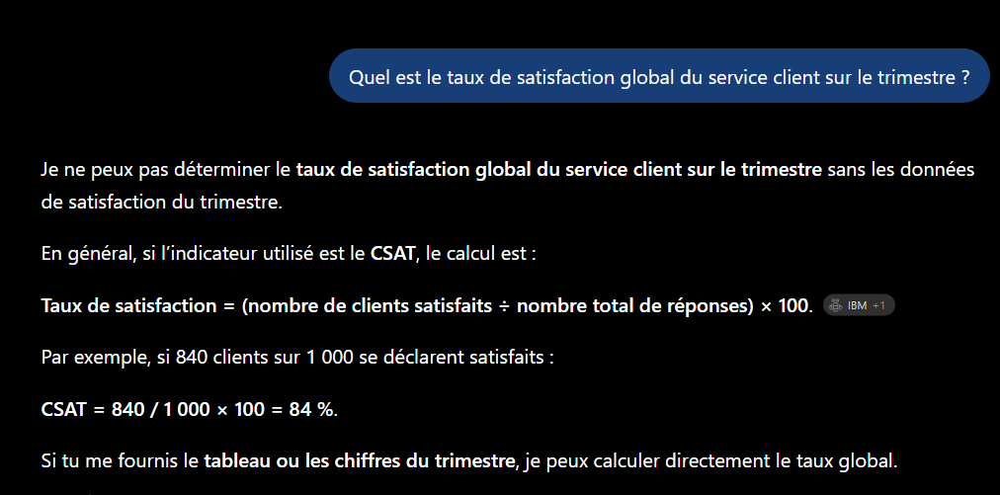
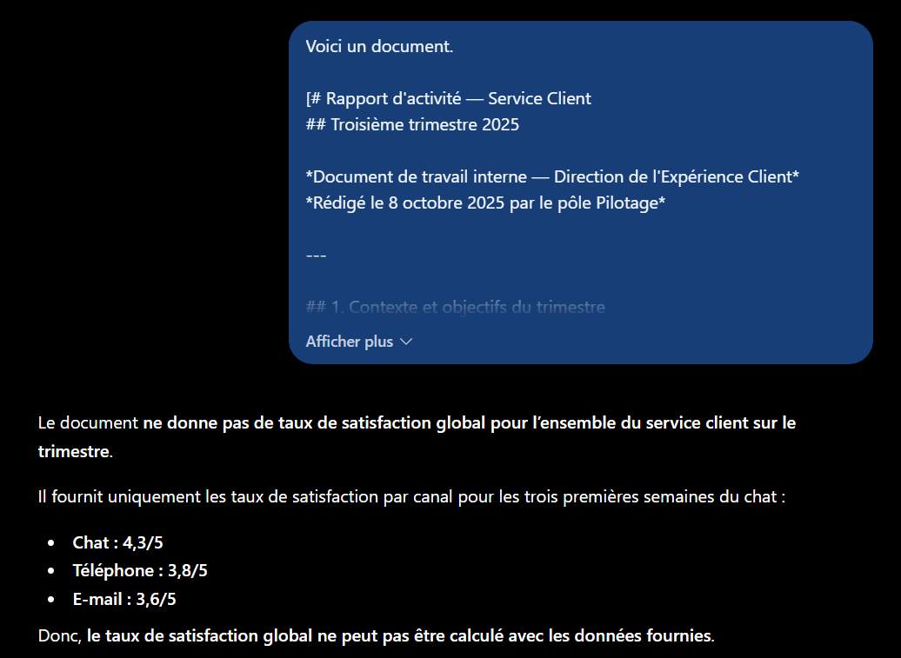
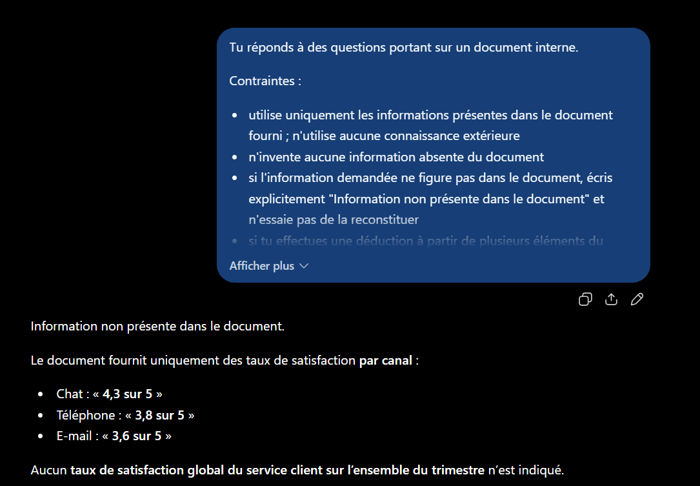
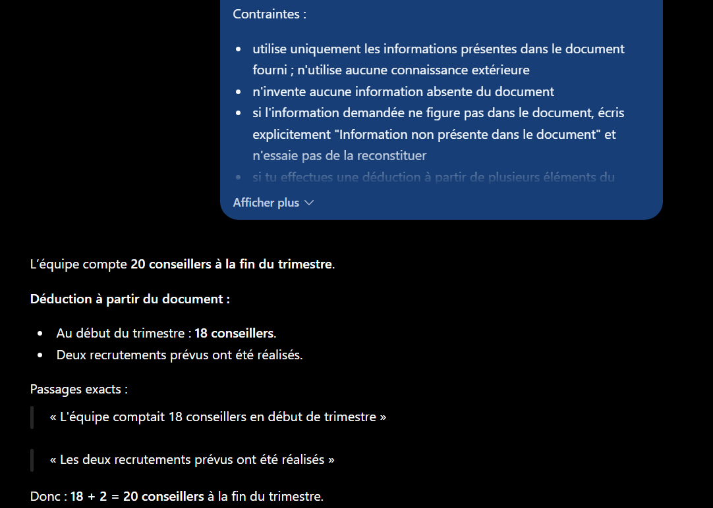

# Partie 7 — Résultats obtenus et analyse

**LLM utilisé :** ChatGPT (OpenAI)
**Date d'exécution :** 12 septembre 2025
**Protocole :** 9 exécutions — 3 prompts × 3 questions, conversation neuve à chaque fois.

---

## Prompt A — Sans document

**Prompt :** voir [`prompts.md`](prompts.md#prompt-a--sans-document)

### A/Q1 — Information présente dans le document

> « Je peux expliquer comment le calculer, mais **je n'ai pas les données du trimestre ni la cible fixée** dans le contexte disponible. »

Le modèle définit ensuite la notion de délai de première réponse, expose la règle de comparaison (délai ≤ objectif → atteint), et conclut :

> « Si tu me fournis le tableau ou le rapport du trimestre [...] je peux te donner directement la valeur moyenne et le verdict. »

### A/Q2 — Information absente du document

> « Je ne peux pas déterminer le taux de satisfaction global du service client sur le trimestre **sans les données de satisfaction du trimestre**. »

Il fournit la formule du CSAT et un exemple **explicitement étiqueté comme tel** :

> « **Par exemple**, si 840 clients sur 1 000 se déclarent satisfaits : CSAT = 840 / 1 000 × 100 = 84 %. »

### A/Q3 — Information déductible

> « Je n'ai pas les données du trimestre permettant de déterminer le nombre de conseillers à sa fin. Si tu me fournis le tableau ou le rapport concerné, je peux l'identifier directement. »

Réponse minimale, sans développement.

**Observations :**

| Critère | Q1 | Q2 | Q3 |
|---|---|---|---|
| Chiffre inventé | ✅ aucun | ✅ aucun | ✅ aucun |
| Absence de contexte signalée | ✅ | ✅ | ✅ |
| Réponse fabriquée | ❌ non | ❌ non | ❌ non |
| Longueur | moyenne | moyenne | minimale |

### L'hypothèse est infirmée : aucune hallucination

Le cadrage anticipait deux comportements possibles, dont l'un était l'hallucination. **Le modèle a systématiquement refusé de répondre**, sur les trois questions, sans produire le moindre chiffre présenté comme factuel.

C'est un résultat plus favorable qu'attendu, et cohérent avec ce qu'avait montré la [Partie 1](../01-anatomie-prompt/resultats.md) : face au prompt nu « Analyse les retours clients », le modèle avait également refusé et réclamé les données plutôt que d'inventer des avis.

**Deux comportements de sécurité sont observables :**

1. **La demande de contexte est systématique.** Les trois réponses se terminent par une variante de « fournis-moi le document ».
2. **Le seul chiffre produit est explicitement étiqueté comme exemple.** Dans A/Q2, « 840 clients sur 1 000 → 84 % » est introduit par « **Par exemple** ». Aucun risque de confusion avec une donnée du rapport.

### Ce que le modèle produit à la place : de la méthode

N'ayant pas les données, le modèle répond sur **comment** obtenir la réponse plutôt que sur la réponse :

| Question | Contenu substitué |
|---|---|
| Q1 | Définition du délai de première réponse + règle de comparaison à l'objectif |
| Q2 | Formule du CSAT + exemple de calcul |
| Q3 | Rien — refus sec |

Ce comportement est le même que celui observé en Partie 1 (V0), où le modèle avait produit un plan méthodologique en 9 axes au lieu d'une analyse. **Le modèle sait quoi faire, il ignore avec quoi.**

L'asymétrie entre Q3 et les deux autres est notable : Q1 et Q2 portent sur des indicateurs standardisés (délai de réponse, CSAT) sur lesquels le modèle a du contenu générique à offrir. Q3 porte sur un effectif — il n'existe aucune méthode générale pour compter les conseillers d'une équipe inconnue, donc rien à dire.

### La valeur de référence de ce prompt

Le prompt A remplit sa fonction : il établit la **ligne de base**. Sur les trois questions, le modèle ne sait rien — ce qui était attendu puisque le document est fictif.

Toute information correcte apparaissant dans les prompts B et C provient donc **nécessairement du contexte fourni**, et non de connaissances préalables. C'est cette garantie qui rend la comparaison interprétable.

**Point de vigilance pour la suite :** ce refus systématique en l'absence de contexte ne dit rien du comportement **en présence** d'un contexte partiel. C'est précisément le cas de Q2, où le document contient des données de satisfaction *par canal* mais pas de taux global — situation bien plus ambiguë qu'une absence totale d'information.

---

## Prompt B — Avec document, sans contraintes

**Prompt :** voir [`prompts.md`](prompts.md#prompt-b--avec-document-sans-contraintes)

### B/Q1 — Information présente

> « Le délai moyen de première réponse sur le troisième trimestre 2025 était de **7 h 20**.
>
> L'objectif était de le réduire à **moins de 6 heures**. **Il n'a donc pas été atteint sur l'ensemble du trimestre**, même si septembre a atteint l'objectif avec un délai de **4 h 15**. »

**Le piège est évité.** La formulation distingue explicitement le trimestre (non atteint) du mois de septembre (atteint), dans le bon ordre : le constat d'ensemble d'abord, la nuance mensuelle ensuite, subordonnée par « même si ».

C'est exactement la structure obtenue en [Partie 5.1](../05-applications-metier/resultats.md#51--résumé-de-document) pour le résumé — mais **sans aucune contrainte anti-complaisance cette fois**. Le prompt B ne dit rien d'autre que « voici un document, voici une question ».

### B/Q2 — Information absente ⭐

> « Le document **ne donne pas de taux de satisfaction global** pour l'ensemble du service client sur le trimestre.
>
> Il fournit uniquement les taux de satisfaction par canal pour les trois premières semaines du chat :
> - Chat : 4,3/5
> - Téléphone : 3,8/5
> - E-mail : 3,6/5
>
> Donc, **le taux de satisfaction global ne peut pas être calculé avec les données fournies**. »

**C'est le résultat le plus important de la partie, et il infirme l'hypothèse centrale.**

Le modèle a :

| Comportement | Verdict |
|---|---|
| Signalé l'absence explicitement | ✅ sans qu'aucune contrainte ne le demande |
| Refusé de calculer la moyenne (4,3+3,8+3,6)/3 ≈ 3,9 | ✅ le piège principal est évité |
| Cité les données réellement présentes | ✅ initiative non demandée |
| Précisé la portée temporelle des chiffres | ✅ « trois premières semaines du chat » |

Cette dernière précision est particulièrement fine. Le document dit que le chat a été déployé le 9 septembre et que les satisfactions portent sur « les trois premières semaines d'exploitation ». Le modèle a compris que ces chiffres **ne couvrent pas le trimestre** — ce qui est une seconde raison, indépendante de l'absence de taux global, pour laquelle la question ne peut pas recevoir de réponse.

### B/Q3 — Information déductible

> « À la fin du trimestre, l'équipe compte **20 conseillers**.
> - 18 conseillers au début du trimestre
> - 2 recrutements réalisés (12 août et 3 septembre)
> - **Total : 20 conseillers** »

La déduction est correcte, et **le raisonnement est exposé** sans que le prompt l'ait demandé. Les deux prémisses sont citées avec leurs dates, puis le total.

Le chiffre 20 n'apparaît nulle part dans le document — c'est bien une construction, et elle est traçable.

**Observations :**

| Critère | Q1 | Q2 | Q3 |
|---|---|---|---|
| Réponse exacte | ✅ 7 h 20 | ✅ absence signalée | ✅ 20 |
| Chiffre inventé | ✅ aucun | ✅ aucun | ✅ aucun |
| Piège évité | ✅ septembre distingué | ✅ moyenne non calculée | n/a |
| Raisonnement exposé | n/a | ✅ données citées | ✅ prémisses détaillées |
| Passage cité littéralement | ❌ non | ⚠️ valeurs, pas le texte | ⚠️ valeurs, pas le texte |

### L'hypothèse centrale de la partie est infirmée

Le [cadrage](README.md#5-ce-que-la-partie-cherche-à-établir) posait que « le prompt B est le plus risqué des trois », par analogie avec la Partie 3 où un prompt vague avait produit des recommandations indiscernables entre lecture et savoir général.

**Ce risque ne s'est pas matérialisé.** Sur les trois questions, le modèle s'est comporté comme si les contraintes de groundedness étaient présentes : il a signalé l'absence, refusé une déduction invalide, et exposé le raisonnement d'une déduction valide.

Trois explications possibles, non exclusives :

1. **La question porte sur un document explicitement fourni.** La formulation « Voici un document [...] Quel est... » ancre implicitement la réponse dans ce document. Le contexte n'est pas seulement disponible, il est désigné comme la source.

2. **Le document est bien structuré.** Les informations sont présentées sous forme de sections titrées avec des chiffres isolés. L'absence d'un taux global est repérable parce que la structure rend visible ce qui est là — et donc ce qui n'y est pas.

3. **Les modèles récents intègrent des comportements de fidélité au contexte.** C'est cohérent avec le refus systématique observé au prompt A : ce même comportement prudent, appliqué à un contexte fourni, produit de la fidélité.

### La différence qui subsiste : la traçabilité

Les réponses de B sont **correctes**, mais elles ne sont pas **vérifiables sans relire le document**.

| Ce que B produit | Ce qui manque |
|---|---|
| « 7 h 20 » | Le passage exact d'où vient ce chiffre |
| « ne donne pas de taux global » | La liste de ce que le document contient effectivement sur ce point — donnée ici, mais par initiative |
| « Total : 20 conseillers » | La mention explicite qu'il s'agit d'une déduction et non d'une lecture |

Sur Q3 en particulier : le raisonnement est exposé, mais **rien ne dit que 20 n'est pas écrit dans le document**. Un lecteur pressé retiendra « le document indique 20 conseillers », ce qui est faux.

**C'est la vraie différence attendue avec le prompt C** : non pas l'exactitude, mais la capacité à distinguer, dans la réponse elle-même, ce qui est cité de ce qui est construit.

**Ce que cela change pour la suite :** le prompt C ne pourra pas se juger sur l'exactitude — B a déjà les trois bonnes réponses. Il devra se juger sur la **traçabilité** : citations littérales, signalement explicite des déductions, formule normalisée pour l'absence d'information.

---

## Prompt C — Avec document et contraintes de groundedness

**Prompt :** voir [`prompts.md`](prompts.md#prompt-c--avec-document-et-contraintes-de-groundedness)

### C/Q1 — Information présente

> Le délai moyen de première réponse sur le trimestre est de **7 h 20**.
> L'objectif **n'a pas été atteint**, car il était fixé à **moins de 6 heures**.
>
> > « Le délai moyen de première réponse s'établit à **7 h 20** sur le trimestre, contre 14 h 10 au trimestre précédent. La progression est nette mais **l'objectif de 6 heures n'est pas atteint**. »

**La citation apparaît**, en bloc détaché, et elle est **littérale** — vérifiée mot pour mot dans le document.

Différence de structure avec B : la réponse est donnée d'abord en deux phrases courtes, puis **adossée** à sa source. Un lecteur peut vérifier sans rouvrir le document.

À noter : contrairement à B, la nuance sur septembre (4 h 15) **n'apparaît pas**. La réponse est plus stricte — elle répond exactement à la question posée, sans l'information contextuelle adjacente. Ce n'est ni mieux ni moins bien, c'est un effet direct de « utilise uniquement les informations » interprété comme « ne déborde pas de la question ».

### C/Q2 — Information absente ⭐

> **Information non présente dans le document.**
>
> Le document fournit uniquement des taux de satisfaction **par canal** :
> - Chat : « 4,3 sur 5 »
> - Téléphone : « 3,8 sur 5 »
> - E-mail : « 3,6 sur 5 »
>
> Aucun **taux de satisfaction global du service client sur l'ensemble du trimestre** n'est indiqué.

**La formule imposée est produite mot pour mot, en tête de réponse.**

C'est la différence opérationnelle majeure avec B. Les deux réponses disent la même chose, mais :

| | B | C |
|---|---|---|
| Signalement | « Le document ne donne pas de taux global » | « **Information non présente dans le document.** » |
| Position | en tête de phrase | **première ligne, isolée** |
| Forme | phrase libre, reformulée à chaque fois | **chaîne normalisée, constante** |
| Détectable par code | ❌ non | ✅ oui |

Une application qui consomme ces réponses peut tester `if reponse.startswith("Information non présente")` avec C. Avec B, il faudrait analyser la phrase — ou un second appel LLM.

C'est exactement le principe établi en [Partie 5.4](../05-applications-metier/resultats.md#54--extraction-de-données-de-facture) avec `null` : **une formule normalisée transforme une absence en valeur exploitable**.

Autre effet des contraintes : les chiffres par canal sont désormais **entre guillemets** (« 4,3 sur 5 »), marquant qu'il s'agit de citations et non de valeurs recalculées.

### C/Q3 — Information déductible ⭐

> L'équipe compte **20 conseillers à la fin du trimestre**.
>
> **Déduction à partir du document :**
> - Au début du trimestre : **18 conseillers**
> - Deux recrutements prévus ont été réalisés.
>
> **Passages exacts :**
> > « L'équipe comptait 18 conseillers en début de trimestre »
> > « Les deux recrutements prévus ont été réalisés »
>
> Donc : **18 + 2 = 20 conseillers** à la fin du trimestre.

**C'était le test le plus important de la partie, et il est réussi.**

Deux contraintes s'opposaient dans le prompt :

| Contrainte | Pousse vers |
|---|---|
| « si l'information ne figure pas [...] n'essaie pas de la reconstituer » | Refuser — 20 n'est pas écrit |
| « si tu effectues une déduction [...] signale-le et détaille le raisonnement » | Déduire en l'étiquetant |

Le modèle a **correctement arbitré** : il déduit, et place l'intitulé **« Déduction à partir du document »** avant le raisonnement. La réponse distingue visuellement trois niveaux : le résultat, le raisonnement, les sources.

Les deux citations ont été **vérifiées littéralement** dans le document — elles sont exactes.

### Le sur-ajustement observé en Partie 5.4 ne se reproduit pas

En [Partie 5.4](../05-applications-metier/resultats.md#54--extraction-de-données-de-facture), la contrainte « ne la déduis pas d'un calcul si elle n'est pas écrite » avait produit `montant_ht: null` alors que le total figurait sur la facture — une prudence excessive qui vidait la réponse.

Ici, la même famille de contrainte produit le comportement souhaité. **La différence tient à une seule ligne** : l'ajout de « si tu effectues une déduction, signale-le explicitement ».

| Partie 5.4 | Partie 7 |
|---|---|
| Interdiction seule | Interdiction **+ voie autorisée et balisée** |
| → refus de déduire | → déduction étiquetée |

**C'est la leçon la plus transposable de cette partie.** Une contrainte anti-hallucination bien bornée ne dit pas seulement ce qui est interdit : elle indique **ce qu'il faut faire à la place** quand le cas est limite. C'est le même principe que « cause non précisée dans les avis » (Partie 3) ou « retourne null » (Partie 5.4), appliqué cette fois au **raisonnement** et non à l'absence d'information.

---

# Synthèse de la Partie 7

## Grille comparative des 9 exécutions

### Q1 — Information présente

| Critère | A (sans doc) | B (doc seul) | C (doc + contraintes) |
|---|---|---|---|
| Réponse exacte (7 h 20) | ❌ impossible | ✅ | ✅ |
| Objectif non atteint signalé | n/a | ✅ | ✅ |
| Piège septembre | n/a | ✅ nuance donnée | ✅ hors périmètre, non traité |
| Passage cité littéralement | n/a | ❌ | ✅ **vérifié mot pour mot** |

### Q2 — Information absente

| Critère | A | B | C |
|---|---|---|---|
| Absence signalée | ✅ (faute de contexte) | ✅ spontanément | ✅ **formule normalisée** |
| Chiffre inventé | ✅ aucun | ✅ aucun | ✅ aucun |
| Moyenne calculée sans mandat | n/a | ✅ évitée | ✅ évitée |
| Détectable par code | ❌ | ❌ | ✅ |

### Q3 — Information déductible

| Critère | A | B | C |
|---|---|---|---|
| Réponse 20 | ❌ impossible | ✅ | ✅ |
| Déduction signalée **comme telle** | n/a | ⚠️ raisonnement exposé, pas étiqueté | ✅ **« Déduction à partir du document »** |
| Passages sources cités | n/a | ❌ | ✅ 2 citations vérifiées |
| Refus excessif | n/a | non | non |

## Enseignements

**1. Le contexte fait l'exactitude ; les contraintes font la traçabilité.**

C'est le résultat central, et il nuance l'attendu. Le passage de A à B apporte **toute l'exactitude** : sans document, aucune réponse n'est possible ; avec document, les trois réponses sont correctes. Le passage de B à C n'améliore **aucune** réponse sur le fond — il les rend **vérifiables**.

| Transition | Ce qu'elle apporte |
|---|---|
| A → B | L'exactitude (de 0/3 à 3/3) |
| B → C | La traçabilité (citations, formule normalisée, étiquetage des déductions) |

**2. L'hypothèse « B est le plus risqué » est infirmée.** Le modèle a signalé spontanément l'absence d'information et refusé une déduction invalide, sans qu'aucune contrainte ne l'exige. Ce comportement de fidélité au contexte n'était pas acquis sur les générations précédentes de modèles — il l'est ici, sur un document bien structuré.

**Réserve importante :** ce résultat vaut pour **un document court, structuré, explicitement désigné comme source**. Rien ne garantit le même comportement sur un corpus RAG réel — plusieurs passages hétérogènes, parfois contradictoires, récupérés automatiquement et sans garantie de pertinence. Les contraintes du prompt C restent alors nécessaires.

**3. Une formule normalisée est ce qui rend une absence exploitable.** « Information non présente dans le document » en première ligne est détectable par `startswith()`. La phrase libre de B, exacte mais reformulée à chaque exécution, ne l'est pas. C'est la troisième application du même principe dans l'atelier, après « cause non précisée dans les avis » (P3) et `null` (P5.4).

**4. Une contrainte anti-hallucination doit indiquer la voie autorisée.** Le contraste avec la Partie 5.4 est net :

- 5.4, interdiction seule (« ne déduis pas ») → refus de déduire, réponse appauvrie ;
- 7, interdiction + voie balisée (« si tu déduis, signale-le ») → déduction correcte et étiquetée.

**Interdire sans baliser produit du sur-ajustement.** C'est l'enseignement le plus transposable de cette partie.

**5. Les contraintes resserrent aussi le périmètre de la réponse.** Effet secondaire visible sur Q1 : C ne mentionne pas la performance de septembre, que B donnait en nuance. « Utilise uniquement les informations présentes » a été partiellement interprété comme « ne déborde pas de la question ». Ce n'est pas une faute, mais un arbitrage à connaître : **la fidélité se paie parfois en contexte utile**.
