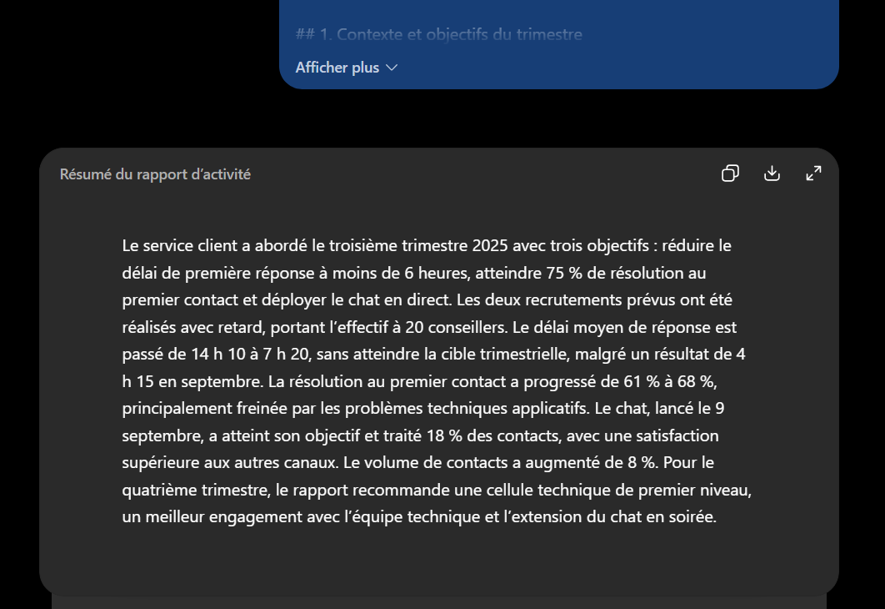
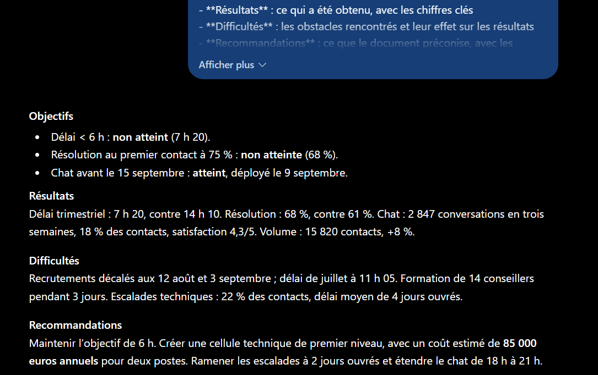
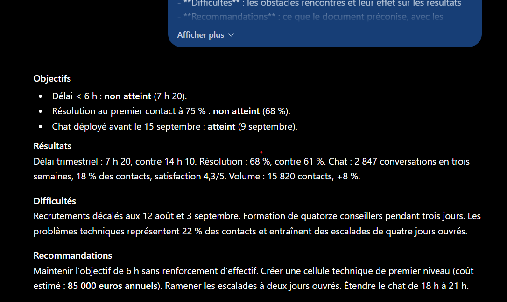

# Partie 8 — Résultats obtenus et analyse

**LLM utilisé :** ChatGPT (OpenAI)
**Date d'exécution :** 12 septembre 2025
**Protocole :** 6 exécutions — 3 prompts × 2 répétitions, conversation neuve à chaque fois.
**Document source :** [`rapport-trimestriel.md`](../data/rapport-trimestriel.md), **804 mots**.

Les réponses intégrales sont dans [`reponses/`](reponses/). Les mesures sont produites par [`mesurer.py`](mesurer.py).

---

## 1. Mesures automatiques

Sortie brute du script :

| Exécution | Mots | Compression | Chiffres clés | Nombres suspects |
|---|---:|---:|---:|---|
| A-exec1 | 263 | 32,7 % | 7/8 | 10, 32025 |
| A-exec2 | 268 | 33,3 % | 7/8 | 10, 32025 |
| B-exec1 | 146 | 18,2 % | 5/8 | 10 |
| B-exec2 | 152 | 18,9 % | 5/8 | 10 |
| **C-exec1** | **135** | **16,8 %** | **7/8** | 05, 10, 11 |
| **C-exec2** | **127** | **15,8 %** | **7/8** | 10 |

### Les « nombres suspects » sont tous des faux positifs

Vérification manuelle de chaque occurrence :

| Nombre signalé | Origine réelle | Verdict |
|---|---|---|
| `10` | « 14 h **10** » — délai du trimestre précédent | ✅ faux positif |
| `05` | « 11 h **05** » — délai de juillet | ✅ faux positif |
| `11` | « **11** h 05 » | ✅ faux positif |
| `32025` | « **3** septembre » + « **2025** » concaténés par la normalisation | ✅ faux positif |

**Aucune invention numérique sur les six exécutions.** Le script découpe les horaires au format `XX h YY` en deux nombres, et supprime les espaces avant extraction — deux limites de l'outil, pas des résumés.

C'est un rappel utile : **un critère automatisé mesure ce qu'il sait mesurer, pas ce qu'on croit lui demander.** Sans la vérification manuelle, on aurait conclu à tort à des hallucinations.

---

## 2. Prompt A — Minimal

**Longueur : 263 et 268 mots** — soit 33 % du document, ce qui est long pour un résumé.

**Couverture : 7/8**, seul le « 22 % des contacts techniques » manque.

**Qualité de fond :** meilleure qu'attendu. Le résumé signale explicitement les objectifs manqués :

> « L'objectif de 6 h **n'est pas atteint** sur l'ensemble du trimestre »
> « L'objectif de 75 % **n'est pas atteint** »

**Le piège septembre est évité** — sans aucune contrainte le demandant.

**L'hypothèse est donc partiellement infirmée.** On attendait un résumé peu hiérarchisé et complaisant ; on obtient un résumé structuré, fidèle et complet. **Le seul vrai défaut de A est sa longueur** : 265 mots en moyenne, là où un comité de direction en lira 150.

---

## 3. Prompt B — Contrainte de longueur

**Longueur : 146 et 152 mots.** La contrainte est respectée à 2 mots près sur B-exec2 — dépassement marginal de 1,3 %.

**Couverture : 5/8.** Trois chiffres sautent :

| Chiffre perdu | Ce qu'il portait |
|---|---|
| 34 % | Résolution des problèmes techniques — le frein principal |
| 22 % | Part des contacts concernés |
| **85 000 €** | **Coût de la recommandation principale** |

### Ce qui est sacrifié : les chiffres qui fondent les décisions

C'était la question posée dans l'hypothèse. La réponse est nette : **B conserve les constats et perd les moyens de décider.**

Le résumé B dit bien qu'il faut « une cellule technique de premier niveau », mais **sans son coût de 85 000 €**. Un décideur lit une recommandation sans son prix — c'est-à-dire une recommandation qu'il ne peut pas arbitrer.

De même, les 34 % et 22 % étaient les deux chiffres qui **justifient** cette recommandation. B affirme que les problèmes techniques pénalisent la résolution, sans donner l'ampleur.

**Le résumé reste vrai, mais il devient non actionnable.** C'est un mode de dégradation plus insidieux qu'une erreur factuelle : rien n'est faux, et pourtant la décision devient impossible.

**Point positif :** le piège septembre est évité (« malgré 4 h 15 en septembre ») et les objectifs manqués sont signalés.

---

## 4. Prompt C — Prompt complet

**Longueur : 135 et 127 mots** — sous la limite dans les deux cas, avec une marge confortable.

**Couverture : 7/8**, soit **le même score que A pour la moitié des mots**. Seul le 34 % manque.

### C obtient la couverture de A avec la concision de B

C'est le résultat central de la partie :

| | Mots | Couverture | Verdict |
|---|---:|---:|---|
| A | 265 | 7/8 | Complet mais trop long |
| B | 149 | 5/8 | Court mais amputé |
| **C** | **131** | **7/8** | **Court et complet** |

C est **plus court que B** (−12 %) tout en couvrant **deux chiffres de plus**. La contrainte de longueur seule force un arbitrage aveugle ; la structure imposée oriente cet arbitrage vers ce qui compte.

### Les correctifs réinvestis ont fonctionné

| Correctif | Origine | Effet observé |
|---|---|---|
| Rubrique **Difficultés** | P5.1 | ✅ Présente dans les deux exécutions — recrutements décalés, formation, escalades |
| Statut par objectif | P5.1 | ✅ « non atteint (7 h 20) », « atteint (9 septembre) » — lisible d'un coup d'œil |
| Distinction trimestre/mois | P5.1 | ✅ « Délai trimestriel : 7 h 20 » — le mot *trimestriel* est explicite |
| Montants conservés | — | ✅ **85 000 euros annuels** présent, contrairement à B |
| Pas de formule d'introduction | P5.5 | ✅ Le résumé commence directement par « **Objectifs** » |

La rubrique **Difficultés** est la démonstration la plus directe : elle avait entièrement disparu en Partie 5.1 faute d'intertitre correspondant. Ajoutée au prompt, elle apparaît — avec les bons éléments.

### La mise en forme des objectifs

C produit une structure que ni A ni B n'atteignent :

> **Objectifs**
> - Délai < 6 h : **non atteint** (7 h 20).
> - Résolution au premier contact à 75 % : **non atteinte** (68 %).
> - Chat avant le 15 septembre : **atteint**, déployé le 9 septembre.

Cible, statut et valeur réelle sur une seule ligne, pour chacun des trois objectifs. C'est directement exploitable en réunion — et c'est l'effet de la consigne « pour chacune si elle est atteinte ou non », qui a transformé une liste en tableau de bord.

---

## 5. Stabilité inter-exécutions

C'est le critère qu'aucune partie précédente n'avait pu mesurer.

| Prompt | Écart de longueur | Écart de couverture | Structure |
|---|---:|---:|---|
| A | 263 → 268 (**+5 mots**, 1,9 %) | 7/8 → 7/8 | Identique |
| B | 146 → 152 (**+6 mots**, 4,1 %) | 5/8 → 5/8 | Identique |
| **C** | 135 → 127 (**−8 mots**, 5,9 %) | 7/8 → 7/8 | **Identique** |

### L'hypothèse principale est infirmée

On attendait que **l'écart entre exécutions diminue de A à C**. Ce n'est pas le cas : les trois prompts sont également stables sur la couverture et la structure, et C a même la plus forte variation de longueur en pourcentage.

**Mais la stabilité qui compte n'est pas celle de la longueur.** Comparons le contenu de C-exec1 et C-exec2 :

| Rubrique | C-exec1 | C-exec2 |
|---|---|---|
| Objectifs | 3 objectifs, statut + valeur | **identique** |
| Résultats | 7 h 20, 68 %, 2 847, 18 %, 4,3/5, 15 820, +8 % | **mêmes 7 valeurs** |
| Difficultés | 12 août, 3 septembre, 14 conseillers, 22 %, 4 jours | **mêmes éléments** |
| Recommandations | 4 recommandations, 85 000 € | **identiques** |

**Les deux exécutions de C sont substantiellement interchangeables.** Les différences sont purement rédactionnelles : « 14 conseillers » devient « quatorze conseillers », « délai de juillet à 11 h 05 » est omis en exec2.

C'est cette stabilité-là qui compte en production : **deux appels successifs produisent des sorties comparables, agrégeables, et qui décrivent la même réalité.**

### La stabilité de A est plus superficielle

A est stable en longueur et en couverture, mais son ordre de présentation suit le document — ce qui signifie que sa stabilité tient à celle du document, pas à celle du prompt. Sur un document de structure différente, rien ne garantit un résultat comparable. La structure imposée de C, elle, est **indépendante du document source**.

---

## 6. Grille complète

| Critère | A1 | A2 | B1 | B2 | C1 | C2 |
|---|---|---|---|---|---|---|
| 1. Longueur (mots) | 263 | 268 | 146 | 152 | **135** | **127** |
| 2. Compression | 32,7 % | 33,3 % | 18,2 % | 18,9 % | 16,8 % | 15,8 % |
| 3. Couverture /8 | 7 | 7 | 5 | 5 | **7** | **7** |
| 4. Exactitude numérique | ✅ | ✅ | ✅ | ✅ | ✅ | ✅ |
| 5. Stabilité | ✅ | ✅ | ✅ | **✅✅** | **✅✅** | **✅✅** |
| 6. Fidélité | ✅ | ✅ | ✅ | ✅ | ✅ | ✅ |
| 7. Objectifs manqués signalés | ✅ | ✅ | ✅ | ✅ | ✅ | ✅ |
| 8. Piège septembre évité | ✅ | ✅ | ✅ | ✅ | ✅ | ✅ |
| 9. Aucun ajout externe | ✅ | ✅ | ✅ | ✅ | ✅ | ✅ |
| 10. Exploitabilité | ⚠️ trop long | ⚠️ trop long | ❌ coût absent | ❌ coût absent | ✅ | ✅ |
| 11. Hiérarchisation | ⚠️ suit le document | ⚠️ suit le document | ⚠️ | ⚠️ | ✅ | ✅ |

**Classement :** C > A > B.

Le classement **A devant B** est le résultat le plus contre-intuitif : ajouter la seule contrainte de longueur a *dégradé* le résumé. Voir l'enseignement n° 2 ci-dessous.

---

## 7. Enseignements

**1. C obtient la couverture de A pour la moitié des mots.** 131 mots contre 265, même score de 7/8. C'est la démonstration la plus directe de l'atelier : **un prompt complet n'est pas un prompt plus verbeux, c'est un prompt qui dépense mieux son budget de mots.**

**2. Une contrainte isolée peut dégrader le résultat.** B est plus court que A, mais perd trois chiffres — dont le coût de 85 000 € de la recommandation principale. **Contraindre la forme sans orienter le fond force un arbitrage aveugle.** C'est la même leçon qu'en [Partie 1](../01-anatomie-prompt/resultats.md), où V4 (le plus complet) était moins exact que V3 : ajouter une composante n'améliore pas mécaniquement.

**3. Le mode de dégradation de B est insidieux.** Rien n'est faux dans B. Tout ce qu'il affirme est exact, fidèle, et le piège septembre est évité. Il est simplement **non actionnable** : une recommandation sans son prix ne permet pas de décider. Une évaluation qui ne mesurerait que la fidélité noterait B et C à égalité.

**4. La stabilité utile est celle du contenu, pas de la longueur.** Les deux exécutions de C varient de 6 % en longueur mais sont substantiellement interchangeables : mêmes rubriques, mêmes valeurs, mêmes recommandations. C'est ce qui permet d'agréger ou de comparer des sorties en production.

**5. La structure imposée rend la stabilité indépendante du document.** A doit sa régularité à celle du rapport source. C tient la sienne de son prompt — elle survivrait à un document organisé autrement.

**6. Les correctifs issus des parties précédentes ont tous produit leur effet.** La rubrique *Difficultés*, absente en P5.1 faute d'intertitre, apparaît dès qu'on l'ajoute. Le statut par objectif transforme une liste en tableau de bord. **Un prompt s'améliore par itérations documentées, pas par intuition** — ce qui suppose de conserver la trace de ce qui a échoué.

**7. Un critère automatisé mesure ce qu'il sait mesurer.** Les quatre « nombres suspects » étaient des faux positifs dus au découpage des horaires `14 h 10`. Sans vérification manuelle, on aurait conclu à des hallucinations inexistantes. **Une grille automatique accélère l'évaluation, elle ne la remplace pas.**

**8. Le prompt nu était meilleur qu'attendu.** A signale les objectifs manqués et évite le piège septembre sans qu'on le lui demande. Ce n'est pas la première fois dans l'atelier — les [Parties 5.1](../05-applications-metier/resultats.md) et [7](../07-rag/resultats.md) l'ont aussi montré. **Les contraintes servent moins à obtenir un bon résultat qu'à le garantir** : ce que le modèle fait spontanément sur un document bien structuré, rien n'assure qu'il le fera sur le suivant.
