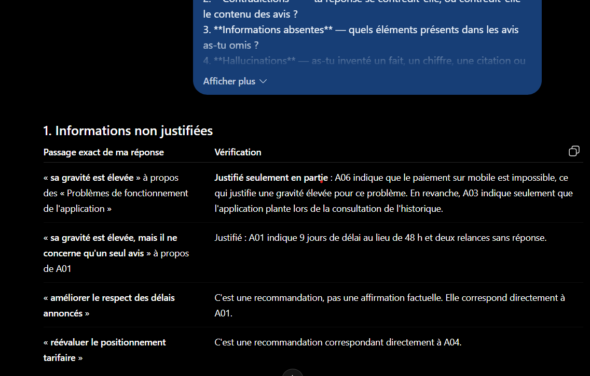
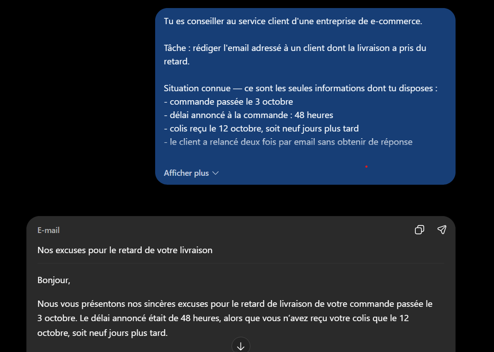

# Rapport final — Atelier Prompt Engineering

**AI Business Assistant** · ChatGPT (OpenAI) · septembre 2025

Ce rapport synthétise les neuf parties de l'atelier. Chaque partie dispose de son propre dossier avec le cadrage, les prompts exécutables et l'analyse détaillée des réponses obtenues. On trouvera ici les résultats marquants, les captures les plus démonstratives et les enseignements transversaux.

**Sommaire :** [Méthode](#méthode) · [Partie 1](#partie-1--anatomie-dun-prompt) · [2](#partie-2--comparer-les-techniques-de-prompting) · [3](#partie-3--raisonnement-et-auto-vérification) · [4](#partie-4--sorties-structurées) · [5](#partie-5--applications-métier) · [6](#partie-6--machine-learning) · [7](#partie-7--rag) · [8](#partie-8--évaluation-et-optimisation) · [9](#partie-9--bonus) · [Enseignements](#enseignements-transversaux) · [Limites](#limites-du-travail)

---

## Méthode

**Protocole d'exécution.** Une conversation neuve par prompt, pour éviter qu'une réponse précédente n'influence la suivante. Ce choix a un coût, documenté en partie 6 : les conclusions d'une question ne sont pas disponibles pour la suivante, ce qui produit parfois des réponses moins cohérentes entre elles qu'elles ne le seraient en usage réel.

**Hypothèses écrites avant exécution.** Chaque prompt est accompagné du comportement attendu. Plusieurs hypothèses ont été **infirmées** ; elles sont conservées telles quelles, avec l'écart constaté. C'est le cas notamment de l'hypothèse centrale de la partie 7.

**Vérification systématique des chiffres.** Les calculs produits par le LLM ont été recalculés indépendamment, les citations confrontées au document source, et les mesures de la partie 8 produites par [un script](08-evaluation-optimisation/mesurer.py) plutôt qu'à la main — la partie 6 ayant montré qu'une valeur fausse peut passer inaperçue au milieu de calculs justes.

**Grille d'évaluation fixée à l'avance.** Formalisée en partie 8 avec 11 critères, répartis selon leur vérifiabilité : mesurables automatiquement, vérifiables par confrontation au texte, ou qualitatifs assumés comme tels.

---

## Partie 1 — Anatomie d'un prompt

**Question :** construire un prompt à partir de ses composantes, pour « analyser les retours clients d'une entreprise ».

**Méthode :** cinq versions incrémentales, de l'intention brute (V0) au prompt complet (V4), une composante ajoutée à la fois.

### Le point de départ : une non-réponse

Le modèle refuse d'analyser et réclame les données, tout en proposant un plan méthodologique en 9 axes. **Il sait quoi faire, il ignore ce qu'on attend de lui** — c'est exactement la décision que la composante *Tâche* doit lui retirer.

### L'arrivée : une sortie exploitable

Les cinq thèmes sont exacts, avis pour avis, conformes à la répartition de référence établie manuellement avant l'exécution.

### Résultat contre-intuitif

| Version | Composantes | Exactitude | Couverture |
|---|---|---|---|
| V2 | + Rôle, Contexte | ❌ perd l'avis A07 | — |
| **V3** | + Contraintes, Format | ✅ **5/5 exacts** | ❌ catégorie « Autre » absente |
| **V4** | + Exemples, Critères | ❌ 2 erreurs | ✅ catégorie « Autre » présente |

**V4, la version la plus complète, est moins exacte que V3.** L'exemple few-shot montrait un thème *large* ; le modèle a imité cette granularité et regroupé au-delà du raisonnable, fusionnant SAV et application mobile.

> **L'exemple ne transmet pas seulement un format, il transmet une granularité.** Le [prompt final retenu](01-anatomie-prompt/prompt-final.md) n'est donc ni V3 ni V4, mais leur synthèse corrigée.

---

## Partie 2 — Comparer les techniques de prompting

**Question :** classer « Le service est rapide mais l'application plante régulièrement » en positif / négatif / neutre — un cas mixte qu'aucune des trois classes ne décrit correctement.

### Les quatre techniques convergent

| Technique | Classe | Justification | `mixte` | JSON | Tokens |
|---|---|---|---|---|---|
| Zero-shot | négatif | ❌ | ❌ | ❌ | ~3 lignes |
| One-shot | négatif | ❌ | ❌ | ❌ | ~8 lignes |
| Few-shot | négatif | ❌ | ❌ | ❌ | ~17 lignes |
| **Structuré** | négatif | ✅ | ✅ `true` | ✅ | ~30 lignes |

Trois mots. Le coût en tokens a été multiplié par quatre entre zero-shot et few-shot **sans changer la classe**.

### Ce que le prompt structuré apporte

Le gain n'est pas dans la classe — elle est identique partout. Il est dans **`"mixte": true`**, qui sauve l'information de nuance que les trois autres perdaient définitivement, et dans une justification citant *les deux* éléments du commentaire, ce qui écarte l'hypothèse d'une classification par détection du mot « plante ».

> Un exemple n'a de valeur que s'il **corrige un comportement par défaut indésirable**. Ici, le modèle appliquait déjà la bonne règle : les exemples n'ont rien apporté. Le few-shot enseigne *quoi répondre* ; le prompt structuré définit *quoi produire et comment le justifier*.

---

## Partie 3 — Raisonnement et auto-vérification

**Question :** décomposer un prompt vague, puis demander au modèle de vérifier sa propre réponse.

### Le coût d'un prompt vague

Le diagnostic est juste, mais sur une vingtaine de recommandations produites, **la majorité ne peut pas être déduite des avis** : versions d'OS, conditions de stockage, transporteurs, programmes de fidélité. Elles viennent du savoir général du modèle, sans que rien ne les distingue de ce qui vient des données.

### Ce que la décomposition change

| | Prompt vague | Prompt décomposé |
|---|---|---|
| Recommandations | ~20, largement extrapolées | **3, toutes ancrées** |
| Causes inventées | frôlées | ✅ « cause non précisée dans les avis » ×2 |
| Étapes vérifiables | ❌ monolithique | ✅ 5 étapes distinctes |

**La décomposition n'améliore pas le diagnostic — elle le rend vérifiable.**

### La limite de l'auto-vérification

Le modèle détecte une **vraie faiblesse** de sa réponse (un thème hérite d'une gravité élevée alors qu'un seul de ses deux avis la justifie) et ne fabrique aucune fausse erreur.

Mais il **manque l'omission majeure** : deux avis contredisent partiellement son propre diagnostic et n'apparaissent nulle part. Sa justification est révélatrice — l'étape 1 demandait d'extraire *les problèmes*, donc les avis positifs étaient hors périmètre.

> **L'auto-vérification contrôle la conformité à la consigne, pas la validité de l'analyse.** Elle détecte les incohérences internes, jamais les angles morts du prompt — qu'elle prend pour référentiel. La vérification décisive doit porter sur le prompt, pas sur la réponse.

---

## Partie 4 — Sorties structurées

**Question :** transformer une réponse en prose en JSON exploitable, puis ajouter des règles de validation.

### Le constat le plus net de l'atelier

| Commentaire testé | Difficulté | `confiance` |
|---|---|---|
| Avis négatif franc | facile | **0.99** |
| Idem, avec les 5 règles | facile | **0.99** |
| **Avis mixte par construction** | **ambigu** | **0.99** |

Trois exécutions, trois fois exactement **0,99**. Le champ respecte parfaitement sa règle — un nombre entre 0 et 1 — tout en étant **inutile** : un filtre `confiance > 0.9` laisserait passer tous les cas ambigus.

> **Contraindre le domaine d'un champ ne garantit pas qu'il porte du sens.** Une règle de type n'est pas une règle de sémantique. La partie 2 avait obtenu `"mixte": true` sur ce même avis : **un booléen explicite bat un scalaire dont la sémantique est implicite.**

**Livrable associé :** [`valider.py`](04-sorties-structurees/valider.py), qui traduit les cinq règles en contrat exécutable — 9/9 cas de test passent, dont six sorties non conformes que le prompt seul n'aurait pas empêchées.

---

## Partie 5 — Applications métier

**Question :** cinq prompts indépendants — résumé, traduction, classification de ticket, extraction de facture, email client.

### Le test le plus objectif de l'atelier

La facture testée **ne porte aucun numéro**. Le modèle retourne `"numero_facture": null` au lieu de fabriquer un identifiant plausible à partir de la date ou d'un montant.

C'est le seul endroit de l'atelier où l'on vérifie **objectivement** si le modèle invente — et il n'invente pas.

### Mais la prudence se sur-ajuste

Deux champs valent `null` alors que le total figure sur la facture. Le modèle a appliqué la lettre de la règle « ne la déduis pas d'un calcul » et refusé de conclure que HT = TTC en franchise de TVA.

**La contrainte anti-invention n'a pas distingué *fabriquer* de *déduire*.**

### Bilan des cinq tâches

| Tâche | Forme | Invention | Point notable |
|---|---|---|---|
| Résumé | ✅ 234/250 mots | ✅ aucune | Piège trimestre/mois évité |
| Traduction | ✅ structure identique | ⚠️ « mobile » ajouté | Terminologie métier juste |
| Ticket | ✅ JSON | ✅ aucune | Bonne catégorie, justification faible |
| Facture | ✅ JSON | ✅ aucune | 2 `null` en trop |
| Email | ❌ objet manquant | ✅ aucune | Aucune cause inventée |

> **Aucune hallucination sur les cinq tâches.** Le modèle reprend la formule fournie — « cause en cours d'analyse » — au lieu des « pic d'activité » ou « incident transporteur » qu'il produit spontanément.

---

## Partie 6 — Machine Learning

**Question :** cinq prompts sur un dataset de capteurs volontairement bruité (11 070 relevés), du nettoyage aux métriques d'évaluation.

Le LLM n'a jamais vu le fichier : il reçoit un **profil statistique** (`describe()`, `isna()`, `value_counts()`) et 8 lignes d'extrait. C'est le cas d'usage réaliste.

### 8 indices sur 8 détectés

Le piège principal était **récursif** : la valeur sentinelle `-999` corrompt les statistiques (écart-type de 77,3) qui serviraient à la détecter. Une règle « écarter au-delà de 3 écarts-types » ne l'aurait jamais isolée.

Le modèle a raisonné autrement — il compare la moyenne aux quartiles, constate l'incohérence, en déduit un code d'erreur. Sa conclusion :

> « ne pas appliquer aveuglément `dropna()` ou une détection d'outliers statistique »

### Le conseil méthodologique décisif

Sur une série temporelle horaire, un split aléatoire est une **fuite de données**. La contrainte disait seulement « en tenant compte de la nature des données », sans souffler la réponse :

> « Il ne faut surtout **pas faire un `train_test_split` aléatoire**, car cela mélangerait passé et futur et créerait une fuite temporelle. »

### Une erreur de calcul trouvée

Dans une réponse par ailleurs excellente — formules correctes, cinq contre-exemples chiffrés, PR-AUC recommandée sur données déséquilibrées — **une valeur est fausse** : le F1 d'illustration annoncé à 16,4 % vaut en réalité 18 %.

Les cinq calculs principaux étaient exacts. C'est le sixième, glissé en passant, qui dérape.

> **La qualité rédactionnelle n'est pas un indicateur d'exactitude numérique.** Observation associée : le prompt de la question suivante exigeait « montre le détail du calcul » — et ses cinq vérifications sont exactes. Exiger le détail semble réduire le risque d'erreur.

---

## Partie 7 — RAG

**Question :** trois prompts — sans document, avec document, avec document et contraintes — sur trois questions de régimes différents.

### L'hypothèse centrale est infirmée

Le cadrage posait que le prompt B (document sans contraintes) serait le plus risqué. Il ne l'a pas été.

Sans qu'aucune contrainte ne le demande, le modèle signale l'absence de taux global, refuse de calculer la moyenne des trois canaux — déduction invalide puisque les volumes diffèrent — et précise que ces chiffres ne couvrent que trois semaines.

### Ce que les contraintes apportent réellement

| | Prompt B | Prompt C |
|---|---|---|
| Signalement | phrase libre, reformulée | **formule normalisée** |
| Position | dans le corps | **première ligne, isolée** |
| Détectable par code | ❌ | ✅ `startswith()` |

### Le test décisif : déduire sans inventer

Deux contraintes s'opposaient : « n'essaie pas de reconstituer » et « si tu déduis, signale-le ». Le modèle arbitre correctement — il déduit 20 conseillers sous l'intitulé **« Déduction à partir du document »**, avec les deux passages sources cités. *(Citations vérifiées littéralement dans le document.)*

> **Le contexte fait l'exactitude, les contraintes font la traçabilité.** A → B fait passer de 0/3 à 3/3 réponses correctes. B → C n'améliore aucune réponse sur le fond, mais les rend vérifiables.

---

## Partie 8 — Évaluation et optimisation

**Question :** trois versions d'un prompt de résumé, évaluées sur une grille de 11 critères, avec deux exécutions chacune.

### Mesures

| | Mots | Couverture des 8 chiffres clés | Verdict |
|---|---:|---:|---|
| **A** — « Résume ce texte » | 265 | 7/8 | Complet mais trop long |
| **B** — « en 150 mots » | 149 | **5/8** | Court mais amputé |
| **C** — prompt complet | **131** | **7/8** | **Court et complet** |

### Le classement contre-intuitif : A devant B

Ajouter la **seule** contrainte de longueur a *dégradé* le résumé. B perd trois chiffres, dont le **coût de 85 000 €** de la recommandation principale.

B reste entièrement **vrai** — rien n'y est faux, les objectifs manqués sont signalés. Mais il devient **non actionnable** : une recommandation sans son prix ne permet pas de décider.

> Une évaluation qui ne mesurerait que la fidélité noterait B et C à égalité. **Contraindre la forme sans orienter le fond force un arbitrage aveugle.**

### Sur la stabilité

L'hypothèse — l'écart entre exécutions diminue de A à C — est infirmée : les trois prompts sont également stables en longueur. **Mais la stabilité qui compte est celle du contenu** : les deux exécutions de C sont substantiellement interchangeables, mêmes rubriques, mêmes sept valeurs, mêmes recommandations.

A doit sa régularité à celle du document source ; C tient la sienne de son prompt — elle survivrait à un document organisé autrement.

### Une leçon sur l'évaluation elle-même

Le [script de mesure](08-evaluation-optimisation/mesurer.py) a signalé quatre « nombres suspects ». **Tous étaient des faux positifs** — il découpait `14 h 10` en deux nombres. Sans vérification manuelle, on aurait conclu à des hallucinations inexistantes.

> **Une grille automatique accélère l'évaluation, elle ne la remplace pas.**

---

## Partie 9 — Bonus

Voir le dossier [`09-bonus/`](09-bonus/).

---

## Enseignements transversaux

### 1. Donner une formule à produire bat une interdiction à respecter

C'est le principe le plus solidement établi de l'atelier — **cinq confirmations indépendantes** :

| Partie | Formule imposée | Résultat |
|---|---|---|
| 3 | « cause non précisée dans les avis » | ✅ produite 2× |
| 5.4 | « retourne `null` » | ✅ aucun numéro inventé |
| 5.5 | « cause en cours d'analyse » | ✅ aucune cause inventée |
| 6.1 | « information non disponible dans le profil » | ✅ employée 5× à bon escient |
| 7 | « Information non présente dans le document » | ✅ formule exacte, détectable par code |

Une interdiction laisse un vide que le modèle comble. Une formule occupe ce vide par une valeur vérifiable — et, mieux encore, **détectable par du code**.

### 2. Contraindre la forme ne garantit pas le fond

Récurrent sur quatre parties :

- un champ `confiance` parfaitement typé mais constant à 0,99 ([P4](04-sorties-structurees/resultats.md)) ;
- une justification bien citée qui rate l'argument décisif ([P5.3](05-applications-metier/resultats.md)) ;
- un résumé respectant ses intertitres mais perdant toute une section ([P5.1](05-applications-metier/resultats.md)) ;
- un email de 140 mots sans objet ([P5.5](05-applications-metier/resultats.md)).

**Une règle de type n'est pas une règle de sémantique.**

### 3. Une contrainte anti-hallucination doit baliser la voie autorisée

Le contraste le plus net de l'atelier :

| | Contrainte | Résultat |
|---|---|---|
| [P5.4](05-applications-metier/resultats.md) | « ne déduis pas » *(interdiction seule)* | ❌ `null` sur des montants déductibles |
| [P7](07-rag/resultats.md) | « ne reconstitue pas » **+** « si tu déduis, signale-le » | ✅ déduction correcte et étiquetée |

**Interdire sans baliser produit du sur-ajustement.** La contrainte doit dire ce qu'il faut faire quand le cas est limite, pas seulement ce qui est interdit.

### 4. Un prompt ne s'améliore pas linéairement

Trois démonstrations :

- **V4 moins exact que V3** ([P1](01-anatomie-prompt/resultats.md)) — l'exemple few-shot transmet une granularité non voulue ;
- **V2 perd un avis que V1 trouvait** ([P1](01-anatomie-prompt/resultats.md)) — le contexte oriente vers la saillance au détriment de l'exhaustivité ;
- **B moins bon que A** ([P8](08-evaluation-optimisation/resultats.md)) — la contrainte de longueur sacrifie les chiffres décisionnels.

**Chaque composante doit être évaluée sur tous les critères, pas seulement sur celui qu'elle vise.**

### 5. Le modèle fait souvent bien sans qu'on le lui demande

Quatre occurrences où le comportement souhaité est apparu spontanément : refus d'inventer sans contexte ([P7](07-rag/resultats.md)), signalement d'une information absente ([P7](07-rag/resultats.md)), piège du résumé évité ([P8](08-evaluation-optimisation/resultats.md)), split temporel correct ([P6](06-machine-learning/resultats.md)).

**Mais rien ne le garantit.** Ces résultats ont été obtenus sur des documents courts, structurés et explicitement désignés comme source. Sur un corpus RAG réel — passages hétérogènes, récupérés automatiquement, parfois contradictoires — les contraintes redeviennent nécessaires.

> **Les contraintes servent moins à obtenir un bon résultat qu'à le rendre reproductible et vérifiable.**

### 6. Tout chiffre produit par un LLM doit être recalculé

Une valeur fausse ([P6](06-machine-learning/resultats.md)) dans une réponse par ailleurs excellente. Elle serait passée inaperçue à la lecture : structure claire, formules justes, contre-exemples pertinents.

Observation associée, à confirmer : le prompt exigeant « montre le détail du calcul » a produit cinq vérifications exactes, là où celui qui demandait seulement « un exemple chiffré » contenait l'erreur.

---

## Limites du travail

**Un seul LLM testé.** Toutes les exécutions ont été faites sur ChatGPT. Les comportements observés — notamment la fidélité spontanée au contexte en partie 7 — ne sont pas transposables tels quels à d'autres modèles.

**Peu de répétitions.** Seule la partie 8 comporte deux exécutions par prompt. Partout ailleurs, un tirage unique ne permet pas de distinguer un comportement stable d'une coïncidence. C'est la principale faiblesse méthodologique de l'atelier.

**Des documents favorables.** Le rapport trimestriel et le jeu d'avis clients sont courts, bien structurés et rédigés pour l'exercice. Un corpus réel — mal structuré, contradictoire, volumineux — produirait probablement des résultats moins favorables.

**Des grilles d'évaluation non neutres.** Les huit chiffres clés de la partie 8, les huit indices de la partie 6 : ces listes encodent une définition de ce qui compte. Un autre analyste en retiendrait d'autres. Elles sont explicitées précisément pour être contestables.

**Des corrections non retestées.** Les prompts corrigés proposés en fin de plusieurs parties — [prompt final de P1](01-anatomie-prompt/prompt-final.md) notamment — sont déduits des écarts observés, non validés par une nouvelle exécution.
